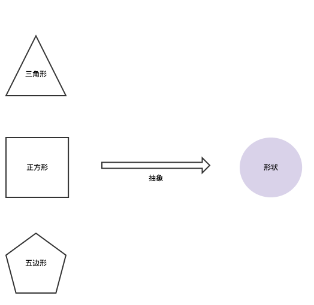
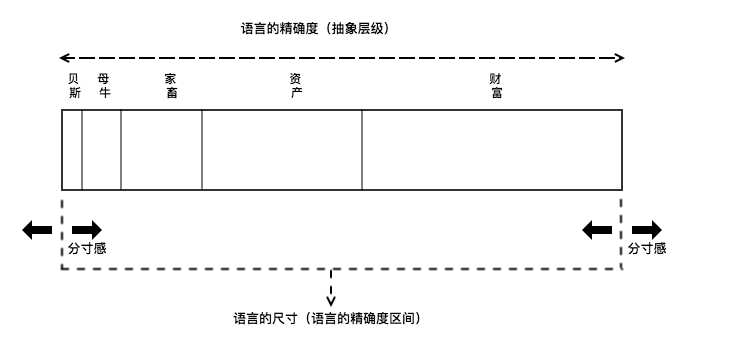

正如美国知名新闻主播Robert Macneil在序言中所言，拜读S.I.早川先生的《语言与人生》（Language in Thought & Action）是我人生中重要的成长经验之一。

写这篇文章也是出于一个朴素的目的，希望好东西能被更多人知道。书中字字珠玑，篇篇精彩，如果只是简单的知识的搬运，唯恐鹦鹉学舌，适得其反。

## 什么是分寸感

酝酿了很久一直找不到合适主题，直到我最欣赏的书店老板说，最近在学习**分寸感**。


俗语说，**“得寸进尺”、“你敬我一尺，我让你一丈”**讲的就是分寸感。通常我们说的分寸感，不仅仅指我们说的话，还包括说话时的态度，包括眼神、肢体反应等等等等，这些都会体现分寸感。而**“打破砂锅问到底”**则体现了语言层面的分寸感。**语言层面的分寸感讲的是内容，即什么该说，什么不该说。**

分寸感是也我一直想要学习和提升的一种能力，虽然日常生活中它还会和情商搭点关系。但就语言层面而言，本书提供了充分的理论基础。

分寸感的英文是：**proper limit**。这两个英文单词很好的解释了**分寸感，即合适的度。**在找到语言的分寸感之前，首先需要知道语言的分寸是什么。

因为这篇文章会有一个小朋友要读，所以从语言的形成开始说起。

## 语言的形成

语言的形成过程，可以简化成如下路径：

**认知 -》象征化 -》语言**

举个例子，口语和文字中的“牛”、“羊”，并不是真的现实中的“牛”、“羊”，我们只是通过“牛”、“羊”这样的单词来象征化的表示实际的“牛”、“羊”。就像地球仪，它并不是真的地球。地球仪上的地图也不是真的疆土。但是，我们可以通过地球仪来象征化的表示地球，通过地图象征化的表示疆土。这也是语言形成的基本过程。**通过不断的对外界事物进行象征化的表示，固化成相应的象征符号，语言就产生了。**看看书中的论述：

> 在数百年相互依存过程中，人类已约定俗成使用那些以肺、喉、舌、牙、唇产生的各种声响来界定神经系统所认定的事物。我们称此约定俗成系统为“语言”。

即语言是一套约定俗成的系统，这套系统里包括了对所有已知事物的象征化表示。所以不同的国家和地区会形成不同的约定俗成，不同的约定俗成又形成了不同的语种，如汉语、英语、法语等等。

## 语言的分寸

学习语言的分寸首先必须理解以下两个关键概念：

**抽象 -》抽象层级**

什么是抽象？

抽象是抽取事物一些本质的东西，剔除次要的表面东西。如下图所示，三角形、长方形、和五角形，进行一次抽象的结果就是“形状”。

在人类语言中，抽象将事物的某些特征排除在外，是非常必要的。仍以形状举例：

````
> 张三折了个三角形，李四折了个长方形，王二麻子折了个五角形。
> 老师想知道他们几个都折了什么？
> 如果没有“形状”的抽象，他就得一个一个问：
> “你折的是三角形、长方形、还是五角形？”
> 如果有了“形状”的抽象，老师就可以直接问:
> “你折了个什么形状？”
````

所以说，**抽象让沟通变得更加便捷。**

以上只是语言的抽象的一个简单的例子。再举一个书中的例子，母牛贝斯，即一头名字叫贝斯的母牛。我们可以对这头牛不断的进行抽象：

````
> 贝斯 -》母牛 -》家畜 -》资产 -》财富
````

通过这样**一层层向上抽象，就形成抽象阶梯，即抽象层级。**不难发现，抽象的层级越向下，所指就越具体，也就是精确度越高。即**语言的精确度，就可以通过语言的抽象层级表示。**

这就好比是一个刻度尺，精度越高，层级越低。刻度尺的精度单位如下：

````
> 毫米 -》厘米 -》分米 -》米
````

仔细研究还可以发现，刻度尺的精度单位，不论是向下还是向下都可以进一步扩展。

````
>…纳米 -》微米 -》毫米 -》厘米 -》分米 -》米 -》千米 -》…-》光年...
````

日常生活中，不同的刻度尺，会有不同的刻度单位。我们只会使用当中的一块精度区间，通常这块区间是**[毫米，千米]**。往下或往上的精度，通常只针对相关专业的人员。

同理，**在语言的精度上（抽象层级），人与人之间语言沟通时也会存在一个精度区间，**这个精度区间就是我们所说的**语言的分寸**。在特定场景，特定对象间沟通的语言精度区间，就是我们所说的语言的分寸。而**语言的分寸感**就是，**当我们触及那个精度边界时是自我喊停还是突破边界的能力。**

说了这么多，也许下图可以让你一目了然。



## 语言的分寸感

**语言的分寸是一种量化的指标，而语言的分寸感却是一种能力。**提升这种能力，可以改善我们与亲人、朋友、以及身边人之间的关系，指导我们的生活。

生活中我们常常面临险滩和暗礁。例如工作中会碰到这样的场景，一群人正在八卦公司或者领导的坏话，可能不一定是坏话而是实话。这时候我们该如何应对？分析他们的谈话内容，从具体细节中抽象出一个层级更高的词汇，如缺少成就感、归属感等等，然后借口离开是不是更高级一点。

当然，**语言的分寸感，不仅仅是在触及边界时自我喊停的决心，还包括突破边界的勇气。**

什么时候需要突破这种边界？不妨看看，突破边界给我们带来什么好处。不难发现，向下突破边界，增加语言的精度，可以提升会话双方的亲密度。俗话说，“男追女隔成墙，女追男隔层纱”讲的就是突破语言分寸，增加亲密度的例子, 当然它同时表明了女性在突破语言分寸边界时所具备的优势。

最近父亲节刚刚过去，母亲节也就在一个月之前。每到这种节日，网络上、朋友圈里就充斥着大量的感恩父母的文字，不是说不好，而是在于转发软文这种方式，对于父母而言，感受力是很弱的。要增加双亲的感受力，需要从提升亲密度开始。今天吃了什么、做了什么、开心什么、不开心什么，这些生活细节可能才是是父母想知道的。当孩子与父母就这些生活细节展开讨论时，你能说他们不亲密吗？

语言的分寸，人与人之间的亲密度，并不是天然的，也不是固定的。它是相互作用的结果。当我们遇到陌生人时，总会尝试去探寻合适的尺度；可是，真正亲人、爱人、以及朋友之间，我们有时候会忘了语言的分寸这回事。当我们粗暴的对待对方时，总会导致沟通的区间被压缩。正如耶稣的严令，“你们愿意人怎样待你们，你们也要怎样待人”。

最后，引用一段书中关于语言的抽象层级的精彩论述：

> 引人入胜的写作者、资讯翔实的演说者，思维精确的思想家及心灵健全的人都对抽象化阶梯的所有层级驾驭自如，快速优雅地依次有高到低、由低到高移动，心绪轻盈灵巧优美如树梢飞跃的猴子。

***

以上是我就原书中所学理论结合个人经验的一次延展，其中**语言的分寸与分寸感**并未出现在原书中，如有偏颇，与作者无关。