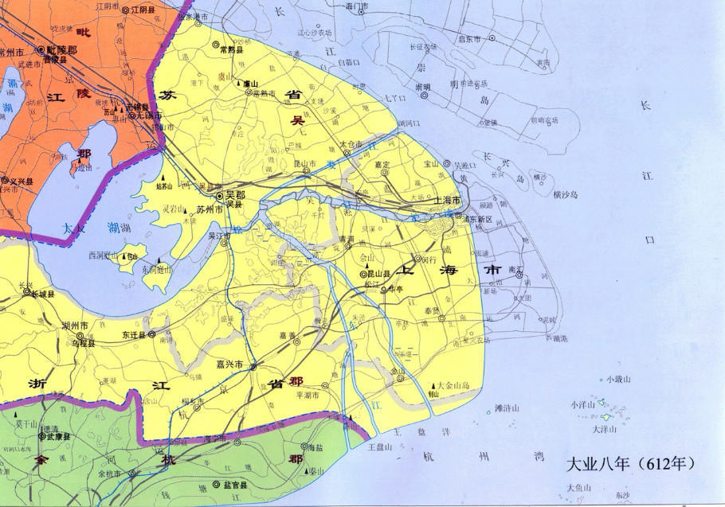
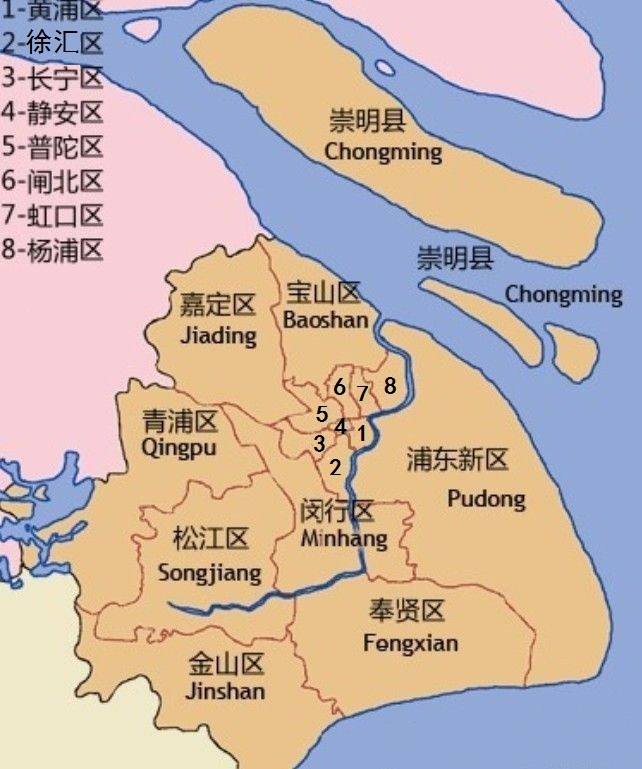
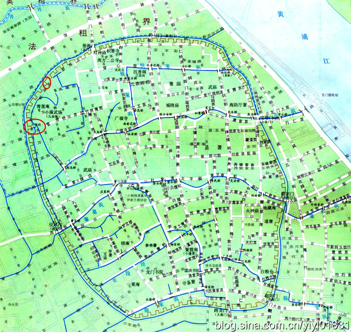
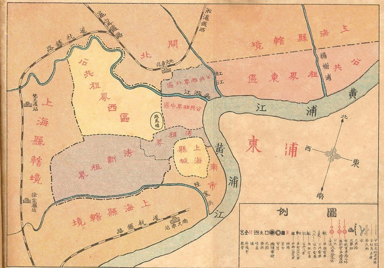

## 上海是海

六千多年以前，今天称为上海这片土地曾经是一片汪洋大海。随着时间的流逝，长江的奔流不息，大海的潮涨潮落，逐渐淤积成了新的土地，打渔为生的先民开始在这一带活动，形成了两个小渔村：上海浦、下海浦。看一下，公元612年的上海地区的地形图，不难发现，今天的浦东新区大部分陆地以及崇明岛均尚未形成。

隋朝大业八年，公元612年，上海地图：

到了南宋成淳三年（1267年），在今小东门十六铺岸边形成集镇，称上海镇。公元1292年，正式设置为上海县。不妨先看一下公元1330年上海地图：

公元1330年 ，上海地图：

再看看今天的上海概要地图：

也许这就是所谓的沧海桑田吧。

## 上海老城

上海老城，或者说上海县城，至少在1842年上海开埠之前，是一个行政级别很低的县。在它之上是松江府。虽然今天松江只是上海市的一个区。但至少在大清年间，松江才是这片土地上最高一级的行政中心。

> 上海县城，其历史据当时1843年不过短短的600年。隶属于松江府的管辖的毗邻黄浦江的小城，直到1330年，才开始设立县城。为了防范盗贼倭寇，在明嘉靖三十二年（1553年），“上海民众在数月之间即修筑了周长9里，高2.4丈（8米）的城墙”。并在嘉靖三十六年（1557年）挖了护城河，增加防御力。每当遇到战事，护城河上的索桥就会吊起，各处城门关闭，外敌想要攻克县城，首先就需要攻克这座城墙。

看一张比较详细的清同治年间上海老城墙地图：

如今上海老城的城墙大部分都已拆毁，护城河也都填埋成了今天的：人民路与中华路。所以今天沿着人民路和中华路走一圈，相当于绕着上海老城走一圈。

上图红圈位置是城墙遗址：大境阁与一小段未拆老城墙。

## 上海租借

上海其实直到1842年开埠之前都只能算是一个沿海的小渔村。1842年之后上海拥入的大量人口，除了小部分外国淘金者以外，更多的是来自内陆城市逃难的难民，这些难民主要是为了躲避太平天国。

## 徒步路线

- 老西门地铁站出站，先参观文庙（10元门票），顺便看看上海老城区。
- 出城区，沿这中华路朝大境阁方向行走，参观大境阁（5元门票）
- 从大境阁出来，朝外滩方向徒步，走到十六铺
- 沿着十六铺参观外滩，一直走到陈毅广场
- 出陈毅广场，对面就是英领事馆，外滩上最早的租界建筑
- 沿南京路徒步到人民广场