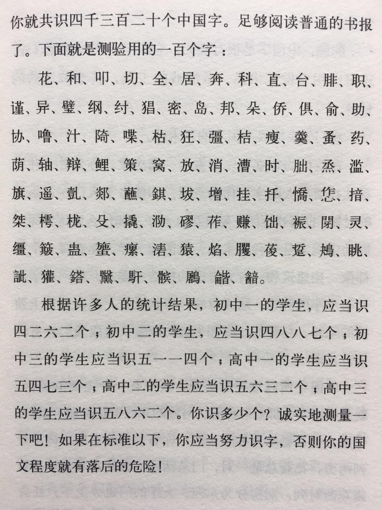
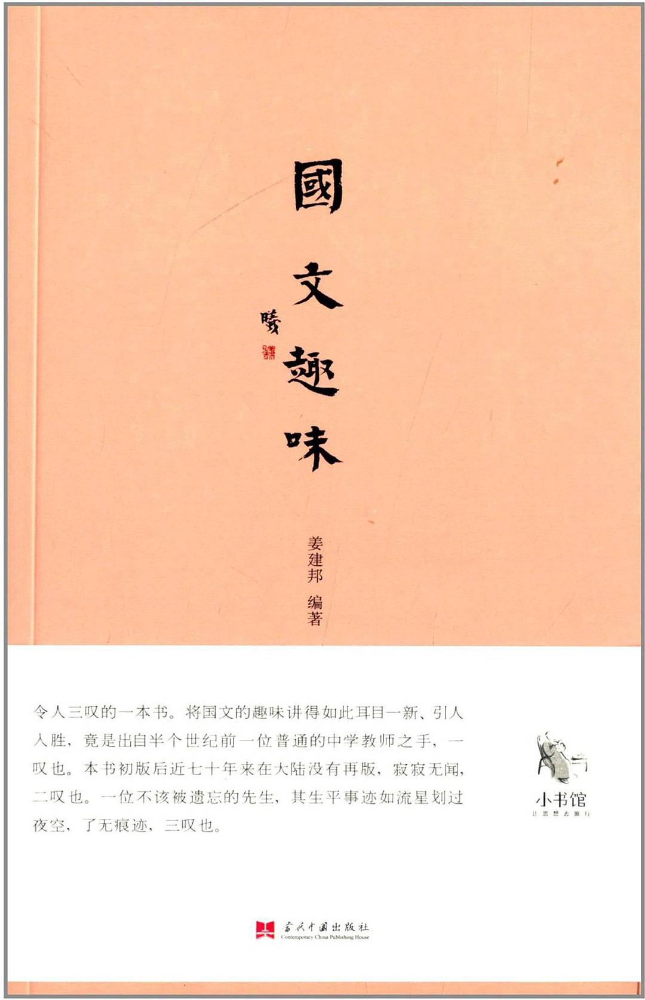

## 1 先生生平
「抢先生」原名姜建邦，民国时期任教于上海缉规中学（现上海市东中学）的一名国文教员。其教学内容常多趣味，学生拥簇者众。某年暑假过后，原本教学初三的姜先生改教高二国文，导致初三学生向校长情愿，校长不得已答应学生的请求。先生原本只教一个班变成了两个班都教。「抢先生」的故事不胫而走，姜先生也就成了「抢先生」。

对于国文课，学生常感枯燥无味。「抢先生」之所以为「抢先生」，是因先生收集了大量国文趣味资料，辅之教学。如同盐调和青菜，极大的激发了学生对于国文学习的兴趣。枯燥无味的国文课突然妙趣横生。

先生还在自序中讲了一则在夜校教学的故事，颇为得意。“教一班初二语文，起初只有二十几个人，他们听得很得意，风声传开，学生渐来渐多，从二十几人增至四十几人，教室里空地方都立满了。后来改在大礼堂上课，不到一个星期，学生从二十几人增到一百二十几人。”换到今天，我想「抢先生」应该已经上了百家讲堂，微博粉丝少说几百万。

民国三十年，主导生活的是战争而非科技。没有录音录像技术，在一个兵荒马乱的年代，姜先生凭个人之力，将其精彩的教学诉诸笔端，实乃后人之福。其生平细节现已无从考证，这本书则是先生教学生涯的最好注脚。

## 2 趣味一二

当初偶然发现这本《国文趣味》的繁体版，立刻被其中的几颗趣味之「盐」吸引驻足。不妨举例一二。
 
### 2.1 汉字的趣味： 你知道你识多少字吗？

书中给出了一张百字图，读者只需要测试这一百个字，每个字代表一百三十五个字。一个一个的认识，只要知道那个字的读音和意思，就是识了那个字。再将你识得的字数乘以**135**就是自己的识字数量了。如果之知道读音不知道意思，或是知道意思不知道读音，则算认识半个字，统计识字数时就是**0.5**乘以**135**。不妨看看这张表。

> 花、和、叩、切、全、居、奔、科、直、台、
> 腓、职、谨、异、壁、纲、纣、猖、密、岛、
> 邦、朵、侨、俱、俞、助、协、噜、汁、**椅**、
> 喋、枯、狂、彊、桔、痩、羹、蚤、药、荫、
> 轴、辨、鲤、策、窝、放、消、漕、时、...
> *很多字不认识，电脑很难打出来还是贴图吧*

按姜老师的统计结果，如下：

- 初中一年级，应当识字 **4262** 个
- 初中三年级，应当识字 **5114** 个
- 高中一年级，应当识字 **5473** 个
- 高中三年级，应当识字 **5862** 个

如何才能算是**知其意**，这个标准可能有些模糊，不妨查看一下【清·赵金毒】编撰的一本字典《环地福分类字课图说》中对字的释意。

> **京**： 天子所居为京；**京师**，京大也，师众也，天子之所居，地大而民众。
> **都**：天子所居之城，曰**都**。天子新立之都，曰**建都**。天子移居，曰**迁都**。

之所以取【京、都】为例，主要是因为从这两个字的意思解答了我长久以来关于**北平**还是**北京**之惑。正如西安古称西京，洛阳古称洛京，民国政府迁都南京之后，北京改名北平。

以上算是识字标准中的**知其意**。以此算来，你识多少字？

### 2.2 文体的趣味： 回文诗

回文诗，即回环反复，从任一句开始读，再从头接上，均可以读通。先生举了一个茶壶底部所刻文字为例：

>  可 -> 以 -> 清 -> 心 -> 也

无论从哪个字开始，再从头接上均可以读通。回文诗，则是换成诗句。如下：

>  春晚落花余碧草，
>  夜凉低月半梧桐。
>  人随雁远边城暮，
>  雨映疏帘绣阁空。

## 3 为什么有趣

对于普通汉语的使用者而言，很少有人能向姜老师一样发现诸多趣味。

全书，姜先生将国文趣味分为六个主题，一一述之，分别是：

- 汉字的趣味
- 文体的趣味
- 文人的趣味
- 文章的趣味
- 读书的趣味
- 作文的趣味

每个主题读下来，不会觉得累，反而兴趣盎然。如同听姜先生当面授课，获益匪浅。为何普通人很少发现国文趣味。书中的一篇《写作的兴趣》给出了完美解答。

> **普通人最感觉兴趣的事是他熟习的事，换句话说，他会做、做得比别人好的事情，就感觉着有趣味。**

姜先生能够发现诸多趣味，正是因为其在教学上精进，让他比一般的国文老师做得更好。越是做得好，越觉得有趣味，越觉得有趣味，做得也就越好，形成良性循环。

从事专业的国文研究或教学的人毕竟少数，但是每个人总是有各自之所熟习之事。日复一日，经年累月，那些在某一方面出类拔萃的人一直存在。他们常常不是厉害一点点，而是厉害一大截。我想同样基于相同的原因，他们发现了趣味之「盐」。

## 4 图书推荐

《国文趣味》是本小书，它的主要读者是学生以及从事汉语教学的老师。对于一名以机器语言为业的文学爱好者来说，借坐车及方便之余，偷得片刻欢愉，实乃快事。唯一遗憾是当初没有买下繁体版，而是购买了国内的简体版，**文字的趣味**一章散失了些许趣味。

好书很多，读完愿意写篇文字的不多。就写到这吧。

