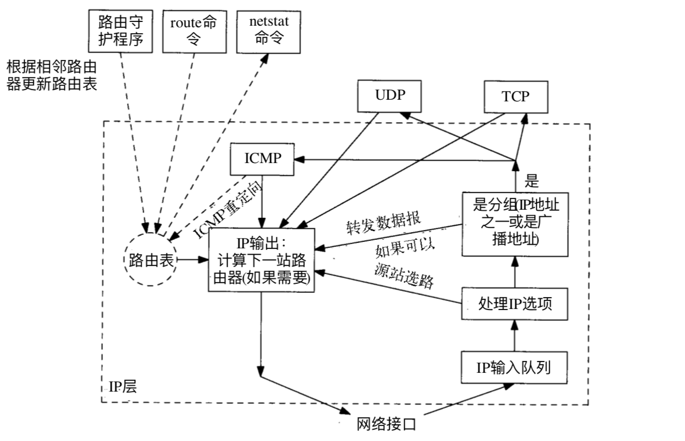

## 1 路由原理



从图示中可以看出：能够操作系统路由表的的有三个实体:

- 路由守护程序 `routed`
- 路由命令 `route`
- `netstat`命令

其中，`netstat`命令只能读取路由信息无法直接对系统路由表进行操作。

增删路由表信息，只能由路由守护程序 `routed`与路由命令 `route`提供。两者的区别在于：

守护程序 `routed`提供动态路由管理功能，即通过实际网络状况操作**动态路由**信息。

路由命令 `route` 则提供了供系统管理员修改**静态路由**信息的接口。

下面分别就：`linux`系统与`mac`系统进行命令对比介绍。

## 2 路由表查询

### 2.1 Linux

````bash
# netstat 
$: netstat -rn
Kernel IP routing table
Destination     Gateway         Genmask         Flags   MSS Window  irtt Iface
0.0.0.0         172.16.15.253   0.0.0.0         UG        0 0          0 eth0
169.254.0.0     0.0.0.0         255.255.0.0     U         0 0          0 eth0
...

# ip route
$: ip route list
default via 172.16.15.253 dev eth0
169.254.0.0/16 dev eth0 scope link metric 1002
172.16.0.0/20 dev eth0 proto kernel scope link src 172.16.5.102
...
````

`ip` 命令是一个非常强大网络管理命令，不仅仅是操作路由表。更多功能请参阅 `man ip` 或者 `tldr ip` 。

### 2.2 MacOS

````bash
$: netstat -rn
````
该系统不支持`ip`命令。

## 3 路由表操作

### 3.1 Linux

````bash
# 格式: ip route { add | del | change | append | replace } ROUTE
# add
$: ip route add 192.168.0.0/24 via 172.16.15.253 dev eth0

# del
$: ip route del 192.168.0.0/24 via 172.16.15.253 dev eth0

# get 指定目的IP的路由信息
$: ip route get 172.18.0.10
172.18.0.10 dev br-6e39d6696d98 src 172.18.0.1
    cache
````

### 3.2 MacOS

不支持`ip`命令, 提供独立的`route`命令。更多帮助参考 `man route`

````bash

# add
$: sudo route add -net 192.168.0.0/24 192.168.255.9

# del
$: sudo route del -net 192.168.0.0/24 192.168.255.9

# get 指定目的IP的路由信息, 支持域名查询
$: route get www.google.com
   route to: 74.125.24.105
destination: default
       mask: 128.0.0.0
    gateway: 192.168.255.5
  interface: utun1
      flags: <UP,GATEWAY,DONE,STATIC,PRCLONING>
 recvpipe  sendpipe  ssthresh  rtt,msec    rttvar  hopcount      mtu     expire
       0         0         0         0         0         0      1500         0
````

## 4 路由规则

除了我们常说的系统路由表以外，系统中还有一个路由规则`route rule`的概念。

IP Rule 子命令主要用于控制管理 ip 的**路由规则**。 所谓 `rule` 看起来更像是 `table`. 

这个规则主要管理控制的是**路由表[IP Route Table]**。即，所谓**路由规则**，就是**路由表**。

不妨先看看，默认情况下，系统有哪些路由表：

````
$: ip rule [list]
0:	from all lookup local
32766:	from all lookup main
32767:	from all lookup default
````
默认情况下，系统提供了 `local`, `main`, `default` 三张路由表。

再来看看这三张路由表的具体路由信息：

`local`路由表，主要记录了本地

````
$: ip route list table local
broadcast 127.0.0.0 dev lo proto kernel scope link src 127.0.0.1
local 127.0.0.0/8 dev lo proto kernel scope host src 127.0.0.1
local 127.0.0.1 dev lo proto kernel scope host src 127.0.0.1
broadcast 127.255.255.255 dev lo proto kernel scope link src 127.0.0.1
broadcast 172.17.0.0 dev docker0 proto kernel scope link src 172.17.0.1
...
```` 

`main`路由表，

````
$: ip route list table main
default via 192.168.0.253 dev eth0
169.254.0.0/16 dev eth0 scope link metric 1002
172.17.0.0/16 dev docker0 proto kernel scope link src 172.17.0.1
...
````

可以和`ip route`的输出对比一下，可以看出`ip route`命令就是默认输出`main`路由表信息

再看看`default`路由表, 可以看出，默认情况下，该表是空的。

> `ip rule`子命令作为管理路由表的规则，有什么具体意义呢？具体路由表中的路由信息又是如何路由的呢？

再看看`ip rule list`的输出，不难发现，这三张`路由表`，又称为`路由规则`。只不过`路由规则`在`路由表`的基础上增加了`优先级`的概念。`优先级`可以从具体`路由表`条目前的数字得出。**数字越低，优先级越高**。

### 4.1 自定义路由规则

由此规则，我们就可以增加自己的`路由规则`.按照各自要求设置优先级，以及具体路由表。

实际在操作`ip rule`时，我们常常是将数据包进行**标记**处理，通过对应**标记**来设置相应的路由表。

#### 4.1.1 对数据包进行**标记**

例如，我们机器上有双网卡，eth0与eth1，我们对于所有服务进程发出的数据包，通过匹配具体服务的端口号进行**标记**，如下例子：

对所有来源端口是8080的数据输出包进行标记处理，设置**标记2**

````bash
$: iptables -t mangle -A OUTPUT -p tcp --sport 8080 -j MARK --set-mark 2
````
#### 4.1.2 对**标记**的数据包进行自定义路由
 
既然数据包已经有了标记，既可以具体按标记设置路由规则了。同上的例子，我们首先增加一条路由规则。

````
# 标记2的数据包按照2号路由规则表路由
$: ip rule add priority 10000 fwmark 2 table 2
```` 

再给2号路由规则表添加具体的路由信息：

````
//取 eth1 的默认网关地址
$: gateway=`netstat -rn | grep eth1 | grep H | awk '{print $2}'`

// 添加一条默认路由，使用该规则的包，默认通过网卡eth1进行路由
$: ip route add default via $gateway dev eth1 table 2
````
 
### 4.2 查看路由规则信息
 
````
$: ip route list table 2
````  
