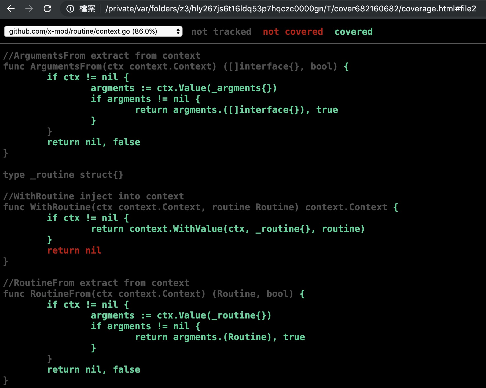

# 1. Awesome-Go 项目

参与过[awesome-go](https://github.com/avelino/awesome-go)项目的`gopher`都知道，每个MR都必须满足它以下的要求：

> Make sure that you've checked the boxes below before you submit PR:
>
>  - [ ] I have added my package in alphabetical order.
>  - [ ] I have an appropriate description with correct grammar.
>  - [ ] I know that this package was not listed before.
>  - [ ] I have added godoc link to the repo and to my pull request.
>  - [ ] I have added coverage service link to the repo and to my pull request.
>  - [ ] I have added goreportcard link to the repo and to my pull request.
>  - [ ] I have read Contribution guidelines, maintainers note and Quality standard.
>

总结出来，就是两项关键质量指标：

- 静态代码质量评分[https://goreportcard.com](https://goreportcard.com)
- 测试代码的覆盖率[https://coveralls.io](https://coveralls.io/)

这两项指标都通过量化的数值对合并项目进行审查。只有满足了指标的阀值要求，你提及的MR才会被合进[awesome-go](https://github.com/avelino/awesome-go)的主分支。

以下是我的两个合并进主分支的项目：

- [JOB, make your short-term command as long-term job](https://github.com/liujianping/job)
- [go routine control with context, support: Main, Go, Pool and some useful Executors](https://github.com/x-mod/routine)

代码审查 `Code Review`，程序员本能就是抵制的。我也不列外，但是很多事即使开始抵制，一旦尝试过，就再也停不下来。代码审查`Code Review`属此类。

通过参与[awesome-go](https://github.com/avelino/awesome-go)项目和实际的`Code Review`实践，可以得出：一个 Go 项目的优劣至少在编译期就可以作出初步判断，而判断标准就是以下两项：

- **静态代码审查的通过率**
- **单元测试的代码覆盖率**

# 2. 企业Go项目代码审查

同样在企业内部也遇到相同的问题，面对开发人员能力水平的参差不齐以及各种`Freestyle`的代码风格， 大大增加了企业 `Go` 项目的维护难度。指定一套标准规范，同时将其固化到 `CI` 过程，是非常必要的。

在[awesome-go](https://github.com/avelino/awesome-go)项目中采用的是开源的代码审查项目与集成服务，但这些服务仅用于开源项目。要移植到企业内部，需要一些必要的准备工作。分别找出**静态代码审查的通过率**与**单元测试的代码覆盖率**替代方案。

## 2.1 代码审查神器： golangci-lint

通过收集筛选，**静态代码审查**工具选择[golangci-lint](https://github.com/golangci/golangci-lint)项目。该项目的使用者包括了众多国际大厂： google、facebook、 IBM 等等。其可用性已经被充分的验证过了。

### 2.1.1 审查分类

在[golangci-lint](https://github.com/golangci/golangci-lint)中，它内置了绝大部分`Go`项目需要使用的审查工具。以下就其内置工具做一下简单的分类。分类能够帮助我们快速定制出必要的审查工具，哪些是必要的，哪些是可选的一目了然。

该分类，还可以通过以下命令查询：

````bash
$: golangci-lint help linters
...
##内置Linters分类
Linters presets:
bugs: bodyclose, errcheck, gosec, govet, scopelint, staticcheck, typecheck
complexity: gocyclo, nakedret
format: gofmt, goimports
performance: bodyclose, maligned, prealloc
style: depguard, dupl, gochecknoglobals, gochecknoinits, goconst, gocritic, golint, gosimple, interfacer, lll, misspell, stylecheck, unconvert
unused: deadcode, ineffassign, structcheck, unparam, unused, varcheck
````
更详细的工具使用说明，可以直接跳转到对应的项目页进行查询。

> **代码BUG审查**

- [bodyclose](https://github.com/timakin/bodyclose) - checks whether HTTP response body is closed successfully
- [errcheck](https://github.com/kisielk/errcheck) - Errcheck is a program for checking for unchecked errors in go programs. These unchecked errors can be critical bugs in some cases
- [gosec](https://github.com/securego/gosec) - Inspects source code for security problems
- [govet](https://golang.org/cmd/vet/) - Vet examines Go source code and reports suspicious constructs, such as Printf calls whose arguments do not align with the format string
- [scopelint](https://github.com/kyoh86/scopelint) - Scopelint checks for unpinned variables in go programs
- [staticcheck](https://staticcheck.io/) - Staticcheck is a go vet on steroids, applying a ton of static analysis checks
- typecheck - Like the front-end of a Go compiler, parses and type-checks Go code

> **代码复杂度**

- [gocyclo](https://github.com/alecthomas/gocyclo) - Computes and checks the cyclomatic complexity of functions
- [nakedret](https://github.com/alexkohler/nakedret) - Finds naked returns in functions greater than a specified function length

> **代码格式化**

- [gofmt](https://golang.org/cmd/gofmt/) - Gofmt checks whether code was gofmt-ed. By default this tool runs with -s option to check for code simplification
- [goimports](https://godoc.org/golang.org/x/tools/cmd/goimports) - Goimports does everything that gofmt does. Additionally it checks unused imports

> **代码性能审查**

- [bodyclose](https://github.com/timakin/bodyclose) - checks whether HTTP response body is closed successfully
- [maligned](https://github.com/mdempsky/maligned) - Tool to detect Go structs that would take less memory if their fields were sorted
- [prealloc](https://github.com/alexkohler/prealloc) - Finds slice declarations that could potentially be preallocated

> **代码风格审查**

- [golint](https://github.com/golang/lint) - Golint differs from gofmt. Gofmt reformats Go source code, whereas golint prints out style mistakes
- [stylecheck](https://github.com/dominikh/go-tools/tree/master/stylecheck) - Stylecheck is a replacement for golint
- [interfacer](https://github.com/mvdan/interfacer) - Linter that suggests narrower interface types
- [unconvert](https://github.com/mdempsky/unconvert) - Remove unnecessary type conversions
- [dupl](https://github.com/mibk/dupl) - Tool for code clone detection
- [goconst](https://github.com/jgautheron/goconst) - Finds repeated strings that could be replaced by a constant
- [depguard](https://github.com/OpenPeeDeeP/depguard) - Go linter that checks if package imports are in a list of acceptable packages
- [misspell](https://github.com/client9/misspell) - Finds commonly misspelled English words in comments
- [lll](https://github.com/walle/lll) - Reports long lines
- [gosimple](https://github.com/dominikh/go-tools/tree/master/cmd/gosimple) - Linter for Go source code that specializes in simplifying a code
- [gocritic](https://github.com/go-critic/go-critic) - The most opinionated Go source code linter
- [gochecknoinits](https://github.com/leighmcculloch/gochecknoinits) - Checks that no init functions are present in Go code
- [gochecknoglobals](https://github.com/leighmcculloch/gochecknoglobals) - Checks that no globals are present in Go code

> 无用代码审查

- [deadcode](https://github.com/remyoudompheng/go-misc/tree/master/deadcode) - Finds unused code
- [ineffassign](https://github.com/gordonklaus/ineffassign) - Detects when assignments to existing variables are not used
- [structcheck](https://github.com/opennota/check) - Finds unused struct fields
- [unparam](https://github.com/mvdan/unparam) - Reports unused function parameters
- [unused](https://github.com/dominikh/go-tools/tree/master/cmd/unused) - Checks Go code for unused constants, variables, functions and types
- [varcheck](https://github.com/opennota/check) - Finds unused global variables and constants

### 2.1.2 推荐配置

按`linter`具体功能分类，在进行`ci`的过程中， 配置如下:

  - [x] 代码BUG
  - [x] 代码复杂度
  - [x] 代码格式化
  - [x] 代码性能
  - [ ] 代码风格
  - [ ] 无用代码

勾选是必选项，非勾选按实际情况进行配置。具体如何配置，可以参考 [.golangci.example.yml](https://github.com/golangci/golangci-lint/blob/master/.golangci.example.yml)。

配置好配置文件后，确认配置，通过以下命令查询当前项目配置. 

````bash
# 项目目录下查询具体启用的linters设置
$: golangci-lint linters
````

[golangci-lint](https://github.com/golangci/golangci-lint)配置文件的查询规则是：**从当前目录，逐次向上级目录查询**。

### 2.1.3 CI集成

集成到企业 `Go` 项目的 `CI` 中就很简单，在每个项目的构建过程中，增加以下命令即可：

````bash
# 项目目录下
$: golangci-lint run
````

## 2.2 测试覆盖率审查

完成了**静态代码审查**的准备工作，现在看看**测试代码覆盖率**的方案。

### 2.2.1 Go项目测试覆盖率

在 `Go 1.2` 版本就已经提供了代码测试覆盖率的工具。具体操作如下：

````bash
# 项目整体测试覆盖率, 以 github.com/x-mod/routine 项目为例
$: go test -cover github.com/x-mod/routine | awk '{print $4 " " $5}'
coverage: 83.0%
````

具体测试覆盖率详细信息，可以通过命令行的方式也可以通过网页的方式查看，按[https://dave.cheney.net](https://dave.cheney.net)提供的脚本，简单修改后如下：

````
# 测试覆盖率详情
cover () {
  t=$(mktemp)
  go test $COVERFLAGS -coverprofile=$t $@ && go tool cover -func=$t && unlink $t
}

# 测试覆盖率详情 web方式查看
cover-web() {
  t=$(mktemp)
  go test $COVERFLAGS -coverprofile=$t $@ && go tool cover -html=$t && unlink $t
}
````
具体测试覆盖率详情`cover-web github.com/x-mod/routine`, 效果如图：



命令行效果，读者可以自己测试一下 `cover github.com/x-mod/routine` 。

### 2.2.3 CI集成

如何集成到 `CI` 流程，也很简单了，只需要做一件事： **设置好测试覆盖率的通过值，比对项目的测试覆盖率的值**。简单提供一下取值的脚本函数:

````bash
cover-value(){
  go test -cover $@ | awk '{print $5}' | awk -F. '{print $1}'
}
````

具体比较过程，以及参数配置等过程就交给读者了。

## 3 参考链接

- [awesome-go](https://github.com/avelino/awesome-go)
- [golangci-lint](https://github.com/golangci/golangci-lint)
- [Simple test coverage with Go 1.2](https://dave.cheney.net/2013/10/07/simple-test-coverage-with-go-1-2)