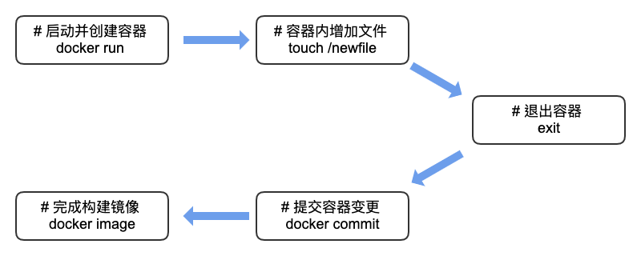

容器化部署越来越多的用于企业的生产环境中，如何构建**可靠、安全、最小化**的 `Docker` 镜像也就越来越重要。本文将针对该问题，通过原理加实践的方式，从头到脚帮你撸一遍。

# 1. 构建镜像

## 1.1 手动构建

手动构建 `Docker` 镜像的流程图，如下：



现在依次按照流程采用命令行的方式手动构建一个简单的`Docker` 镜像。

### 1.1.1 创建容器并增加文件

取`busybox`作为本次试验的基础镜像，因为它足够小，大小才 `1.21MB`。

````bash

$: docker run -it busybox:latest sh
/ # touch /newfile
/ # exit
````

通过以上的操作，我们完成了流程图的前三步。创建了一个新容器，并在该容器上创建了一个新问题。只是，我们退出容器后，容器也不见了。当然容器不见了，并不表示容器不存在了，`Docker` 已经自动保存了该容器。如果在创建时，未显示设置容器名称，可以通过以下方式查找该**消失的容器**。

````bash
# 列出最近创建的容器
$: docker container ls -l
CONTAINER ID        IMAGE               COMMAND             CREATED             STATUS                      PORTS               NAMES
c028c091f964        busybox:latest      "sh"                13 minutes ago      Exited (0) 27 seconds ago                       upbeat_cohen

# 查询容器的详情
$: docker container inspect c028c091f964
...
````

### 1.1.2 提交变更生成镜像

手动构建镜像，很简单。先找到发生变更的容器对象，对其变更进行提交。提交完成后，镜像也就生成了。不过此时的镜像只有一个自动生成的序列号唯一标识它。为了方便镜像的检索，需要对镜像进行命名以及标签化处理。

命令行操作如下:

````bash
# 提交变更, 构建镜像完成
$: docker commit -a JayL -m "add newfile" c028c091f964
sha256:01603f50694eb62e965e85cae2e2327240e4a68861bd0e98a4fb4ee27b403e6d

# 对镜像进行命名, 原镜像ID取前几位就可以了
$: docker image tag 01603f50694eb62e9 busybox:manual

# 验证新镜像
$: docker run busybox:manual ls -al newfile
-rw-r--r--    1 root     root             0 Jun 15 05:25 newfile
````

通过以上两步过程就完成了`Docker` 镜像手动创建。非常简单是不是。但是也非常麻烦，必须先创建新容器在提交变更，生成镜像。整个过程完全可以通过脚本化处理，这也是下节要说的，自动化构建`Docker` 镜像。

## 1.2 自动化构建

### 1.2.1 Dockerfile 构建

自动化构建`Docker` 镜像，`Docker`公司提供的不是SHELL脚本的方式，而是通过定义一套独立的语法来描述整个构建过程, 通过该语法编辑的文件，称为 `Dockerfile`。 自动化构建镜像就是通过编写`Dockerfile`文件构建的。

同样完成上面的工作，用`Dockerfile`写出来就是：

````Dockerfile
FROM busybox:latest
RUN  touch /newfile
````
至于更加详细的`Dockerfile`语法，请参见[官方指南](https://docs.docker.com/engine/reference/builder/)。

完成`Dockerfile`编写后，通过命令触发构建。整个过程，脚本化出来就是:

````bash
$: mkdir autobuild && cd autobuild
$: cat <<EOF > Dockerfile
FROM busybox:latest
RUN  touch /newfile
EOF
$: docker build -t busybox:autobuild .
````

## 2 镜像的存储

## 2.1 镜像的组成

> Docker 镜像是由一组**只读**的镜像层`Image Layer`组成的。而Docker 容器则是在Docker 镜像的基础之上，增加了一层：容器层`Container Layer`。容器层`Container Layer`是**可读写**的。如果对该容器层`Container Layer`进行`commit`提交操作，该层就变成了新的镜像层`Image Layer`。新的`Docker Image`也就构建出来了。

以下官网提供的图示可以很清楚的看出镜像与容器之间的联系与区别：


具体某个镜像的组成`Layer`可以通过如下命令进行查询：

````bash
# 镜像的构建层历史
$: docker history busybox:autobuild
IMAGE               CREATED             CREATED BY                                      SIZE                COMMENT
845cc5130d2c        17 minutes ago      /bin/sh -c touch /newfile                       0B
ef46e0caa533        4 days ago          /bin/sh -c #(nop) CMD ["sh"]                   0B
<missing>           4 days ago          /bin/sh -c #(nop) ADD file:1067e5a... in /  1.21MB
````

不难看出，镜像`busybox:autobuild`一共执行了从底往上的三次层构建。具体构建的指令可以通过第三列的命令得出。`<missing>`的意思是：该层是在其它系统上构建的，在本地是不可用的。只需要忽略就好。

### 2.2 Union FileSystem

要了解 Docker 镜像的存储首先必须了解**联合文件系统 `UnionFS` (Union File System)**，所谓`UnionFS`就是把不同物理位置的目录合并`mount`到同一个目录中。`UnionFS`的具体实现有很多种:

- 早期的UFS
- AUFS
- OverlayFS
  - overlay
  - overlay2

具体`Docker`宿主机上使用那种`UnionFS`文件系统驱动，可以通过如下命令查询:

````bash
$:  docker info | grep Storage
Storage Driver: overlay2
````
`overlay2`是一种更现代的联合文件系统 `UnionFS`，它比`overlay`的早期版本在稳定与性能上都有很大提升。所以一般最新的`Docker`采用的存储驱动使用的都是`overlay2`。

为了方便演示`UnionFS`文件系统，如果是MacOS系统，建议安装`Docker Machine`开启一台新的虚拟机操作，排除因为`Docker for MacOS`运行在虚拟机上的各种环境干扰。具体`Docker Machine`的安装请自行查阅相关文档。

首先创建一台新的`Docker Machine`:

````bash
# 创建
$: docker-machine create ufs
...
Docker is up and running!

# 登录
$: docker-machine ssh ufs
... ok

# 查询 overlay
$: cat /proc/filesystems | grep overlay
nodev	overlay
````

通过确认，这台`Docker Machine`是支持`UnionFS`文件系统的，使用的是`overlay`存储驱动。 既然`UnionFS`就是**把不同物理位置的目录合并mount到同一个目录中**.现在我们通过命令行的方式实现一下`Docker`官网提供`UnionFS`的原理图。


从图中可以看出，我们需要提供两个目录，分别代表`Container Layer`和`Image Layer`。目录名称，取图示右部的名称：

- 目录`upper`， 代表`Container Layer`
- 目录`lower`， 代表`Image Layer`

除了这两个目录以外，通过`UnionFS`挂载目录还需要两个目录：

- 目录`merged`, 代表挂载目录，即合并后的目录
- 目录`work`, 必须为空目录，是`overlay`存储驱动挂载所需的工作目录。

通过命令行实现图示中的文件夹结构：

````bash
# 创建一个测试目录
$: mkdir demo && cd demo

# 创建子目录与文件
$: mkdir upper lower merged work
$: touch lower/file1 lower/file2 lower/file3
$: touch upper/file2 upper/file4

# 通过文件内容区分以下file2
$: echo lower > lower/file2
$: echo upper > upper/file2

# 未挂载
$: ls merged
````
迄今为止，一切都是常规文件系统操作。现在通过`mount`命令进行`UnionFS`文件系统的目录挂载.

````bash
# 目录合并挂载到merged
$: sudo mount -t overlay overlay -olowerdir=lower,upperdir=upper,workdir=work merged

# 挂载完成后
$: ls merged
file1 file2 file3 file4

# file2 使用的是顶层 upper 的file2 文件
$: cat merged/file2
upper
````
下面再分别通过文件的**增删改**加深对`UnionFS`文件系统的理解：

- **新增文件**
````bash
# 新增文件
$: touch merges/file5
$: ls merged/
file1  file2  file3  file4  file5
# 新增文件写在顶层的 upper 文件夹
$: ls upper/
file2  file4  file5
$: ls lower/
file1  file2  file3
````
- **修改文件**
````bash
# 修改文件 CoW 技术
$: echo mod > merged/file1
$: ls upper/
file1 file2  file4  file5
$: cat upper/file1
mod
$: cat lower/file1
````
- **删除文件**
````bash
# 删除文件
$: rm merged/file1
$: ls -al upper | grep file1
c---------    1 root     root        0,   0 Jun 17 10:41 file1
$: ls -al lower | grep file1
-rw-r--r--    1 docker   staff            0 Jun 17 10:15 file1
````

实际操作完成以上过程，相信你对于`UnionFS`文件系统有了更加直观的感受。你可能会问， `Docker Image`的底层镜像是由一组`Layer`组成的，多个底层目录在`UnionFS`中如何挂载？其实很简单，只需要通过`:`分隔即可。

````bash
# 多层目录: lower1 / lower2 / lower3
$: sudo mount -t overlay overlay -olowerdir=lower1:lower2:lower3,upperdir=upper,workdir=work merged
````
挂载完成后，`lower1` / `lower2` / `lower3`之间的层叠顺序又是怎样，读者可以自行测试一下。

最后，我们查询一下系统的挂载列表， 

````bash
mount | grep overlay
overlay on /home/docker/demo/merged type overlay (rw,relatime,lowerdir=lower,upperdir=upper,workdir=work)
````
从现有输出可知目前我们`docker-machine`中仅挂载了一个`overlay`目录。

### 2.3 镜像的存储

现在我们在这台新的`docker-machine`上构建一个`1.2`中所描述的`Docker`镜像: `busybox:autobuild`。

````bash
$: mkdir autobuild && cd autobuild
$: cat <<EOF > Dockerfile
FROM busybox:latest
RUN  touch /newfile
EOF
$: docker build -t busybox:autobuild .

# 完成构建后，现在系统中有两个docker image
$: docker images
REPOSITORY          TAG                 IMAGE ID            CREATED             SIZE
busybox             autobuild           2e32da74b3ad        4 seconds ago       1.22MB
busybox             latest              e4db68de4ff2        2 days ago          1.22MB
````

构建完成后，我们直接看一下`docker-machine`上的文件系统的挂载情况：

````bash
# docker 无容器运行
$: mount
...
/dev/sda1 on /mnt/sda1/var/lib/docker type ext4 (rw,relatime,data=ordered)

# docker 运行容器时
# 重新开启新会话，运行一个容器实例 `docker run -it busybox:autobuild sh`
$: mount
...
/dev/sda1 on /mnt/sda1/var/lib/docker type ext4 (rw,relatime,data=ordered)
overlay on /mnt/sda1/var/lib/docker/overlay2/a54541dd24971b9491a54b43cdf51f4ef9c87c1cd29748bb3fe64dedafd91b56/merged type overlay (rw,relatime,lowerdir=/mnt/sda1/var/lib/docker/overlay2/l/KLGL6INSJ2UBLMAUP5B4IORUTG:/mnt/sda1/var/lib/docker/overlay2/l/BGIT3WQZVII4Z2THF35I6T5V5O:/mnt/sda1/var/lib/docker/overlay2/l/6GZ2NT4UQT6EQK3IT4IGMBXU4T,upperdir=/mnt/sda1/var/lib/docker/overlay2/a54541dd24971b9491a54b43cdf51f4ef9c87c1cd29748bb3fe64dedafd91b56/diff,workdir=/mnt/sda1/var/lib/docker/overlay2/a54541dd24971b9491a54b43cdf51f4ef9c87c1cd29748bb3fe64dedafd91b56/work)
shm on /mnt/sda1/var/lib/docker/containers/e50f19c5bde3fe53cde3729de92f75b74323f7ebb506b0635eb76dd5b81e080a/mounts/shm type tmpfs (rw,nosuid,nodev,noexec,relatime,size=65536k)
nsfs on /var/run/docker/netns/3c464f8003e8 type nsfs (rw)
````
对比输出，能够很明显的看到，暂仅关注 `overlay` 挂载情况。得出：

- 挂载后的目录是: 
  `/mnt/sda1/var/lib/docker/overlay2/a54541dd24971b9491a54b43cdf51f4ef9c87c1cd29748bb3fe64dedafd91b56/merged`
- 容器Layer是:
  `/mnt/sda1/var/lib/docker/overlay2/a54541dd24971b9491a54b43cdf51f4ef9c87c1cd29748bb3fe64dedafd91b56/diff`
- 镜像Layer是:
  `/mnt/sda1/var/lib/docker/overlay2/l/KLGL6INSJ2UBLMAUP5B4IORUTG`
  `/mnt/sda1/var/lib/docker/overlay2/l/BGIT3WQZVII4Z2THF35I6T5V5O`
  `/mnt/sda1/var/lib/docker/overlay2/l/6GZ2NT4UQT6EQK3IT4IGMBXU4T`

其中镜像Layer使用的是软连接。同样的信息，我们可以通`docker inspect`查询出来。

````bash
$: docker inspect <container-id> -f '{{.GraphDriver.Data.MergedDir}}'
$: docker inspect <container-id> -f '{{.GraphDriver.Data.UpperDir}}'
$: docker inspect <container-id> -f '{{.GraphDriver.Data.LowerDir}}'
````

输出的路径就是具体`Docker`镜像的存储位置。

# 3. 最小化 Docker 镜像

## 3.1 为什么要最小化 Docker 镜像

最小化 `Docker` 镜像的原因可总结出以下几条：

- **省钱**，减少网络传输流量，节省镜像存储空间
- **省时**，加速镜像部署时间
- **安全**，有限功能降低被攻击的可能性
- **环保**，垃圾都分类了，浪费资源可耻

## 3.2 如何构建最小化 Docker 镜像

按 `1.3`、`1.4` 中所讨论的镜像的组成原理与存储， 最小化 `Docker` 镜像的主要途径总结下来也就两条：

- **缩减镜像的Layer大小**
- **减少镜像的Layer层数**

先从简单的**减少镜像Layer的层数**开始。

## 3.3 减少镜像的 Layer 层数

### 3.3.1 组合命令

在定义`Dockerfile`的时候，每一条指令都会对应一个新的镜像层。通过`docker history`命令就可以查询出具体`Docker` 镜像构建的层以及每层使用的指令。为了减少镜像的层数，在实际构建镜像时，通过使用`&&`连接命令的执行过程，将多个命令定义到一个构建指令中执行。如：

````Dockerfile
FROM debian:stable

WORKDIR /var/www

RUN apt-get update && \
    apt-get -y --no-install-recommends install curl \
        ca-certificates && \
    apt-get purge -y curl \
        ca-certificates && \
    apt-get autoremove -y && \
    apt-get clean
````

### 3.3.2 压缩镜像层

除了通过将多命令通过`&&`连接到一个构建指令外，在`Docker`镜像的构建过程中，还可以通过`--squash`的方式，开启镜像层的压缩功能，将多个变化的镜像层，压缩成一个新的镜像层。

具体命令就如下:

````bash
$: docker build --squash -t <image> .
````

## 3.4 缩减镜像的 Layer 大小

### 3.4.1 选择基础镜像

缩减Layer的大小需要从头开始，即选择什么样的基础镜像作为初始镜像。一般情况下，大家都会从以下三个基础镜像开始。

- **镜像 scratch**(空镜像), 大小 0B
- **镜像 busybox**(空镜像 + busybox), 大小 1.4MB
- **镜像 alpine** (空镜像 + busybox + apk), 大小 3.98MB

**镜像 busybox** 通过`busybox`程序提供一些基础的Linux系统操作命令，**镜像 alpine**则是在次基础上提供了`apk`包管理命令，方便安装各类工具及依赖包。广泛使用的镜像基本都是**镜像 alpine**。**镜像 busybox**更适合一些快速的实验场景。而**镜像 scratch**空镜像，因为不提供任何辅助工具，对于不依赖任何第三方库的程序是合适的。因为**镜像 scratch**空镜像本身不提供任何`container OS`,所以程序是运行在`Docker Host`即宿主机上的，只是利用了`Docker`技术提供的隔离技术而已。

细心的读者可能会发现，在`MacOS`上编译的程序，采用**镜像 scratch**空镜像时，容器运行会报错：。那是因为，`Docker for Mac`是运行在`Linux`虚拟机上的缘故。所以不可以直接构建`MacOS`格式的可执行程序在`Docker for Mac`上采用空镜像的方式运行。

### 3.4.2 多阶段构建镜像

多阶段构建 `Multi-Stage Build` 是 `Docker 17.05` 版本开始引入的新特性。通过将原先仅一个阶段构建的镜像查分成多个阶段。之所以多阶段构建镜像能够缩减镜像的大小，是因为发布程序在编译期相关的依赖包以及临时文件并不是最终发布镜像所需要的。通过划分不同的阶段，构建不同的镜像，最终镜像则取决于我们真正需要发布的实体是什么。

````Dockerfile
FROM golang:1.11-alpine3.7 AS builder

WORKDIR /app
COPY main.go .
RUN go build -o server .

FROM alpine:3.7

WORKDIR /app
COPY --from=builder /app .

CMD ["./server"]
````

如上的`Dockerfile`就是多阶段构建，在`builder`阶段使用的基础镜像是`golang:1.11-alpine3.7`，显然是因为编译期的需要，对于发布真正的`server`程序是完全没必要的。通过多阶段构建镜像的方式就可以仅仅打包需要的实体构成镜像。

除了多阶段构建以外，如果你还想忽略镜像中一些冗余文件，还可以通过`.dockerignore`的方式在文件中定义出来。功能和`.gitignore`类似。

# 4. 加固 Docker 镜像

最小化`Docker` 镜像的构建完成了，但是，我们的工作却仍未结束。我们还需要对镜像进行**加固**处理。

## 4.1 镜像内容可寻址标识符（CAIID）

镜像内容可寻址标识符(Content addressable image identifiers), 可以对来源基础镜像内容进行校验，确保没有被第三方篡改。具体的操作方式，就是在构建自己镜像的同时，对基础镜像内容进行内容的`sha256`摘要值进行设置，防止在不知情的情况下被篡改。

首先，得出具体镜像的正确`sha256`摘要值.

````bash
# 通过命令查询出具体镜像的sha256摘要
$: docker inspect busybox:autobuild -f "{{.ID}}"
sha256:9b63a0eaaed5e677bb1e1b29c1a97268e6c9e6fee98b48badf0f168ae72a51dc
````

再在`Dockerfile`定义时，设置基础镜像的`sha256`摘要值

````Dockerfile
FROM busybox@sha256:9b63a0eaaed5e677bb1e1b29c1a97268e6c9e6fee98b48badf0f168ae72a51dc
...
````

## 4.2 用户权限

容器一旦创建出来，其默认使用的用户是可以在镜像中进行设置的。通过设置必要的镜像默认用户，可以限制其在容器中的执行权限。在某种程度上也就进行提升了镜像的安全级别。不过，这需要根据具体的业务发布情况进行设置，常规情况下，基础镜像都还是root用户作为默认用户。

安全原则：**构建镜像本身是为了特定的应用定制的，默认情况下应该尽可能的降低用户权限。**

## 4.3 SUID与SGID问题

除了镜像本身设置必要的默认用户以外，在镜像中，还会存在一类程序，即使是通过普通用户执行，但在运行时会以更高级别的权限执行。就是系统针对可执行文件与目录提供的SUID与SGID特殊权限。

通过对可执行文件设置SUID或SGID属性，原本执行命令的用户会切换成为命令的所有者或是所属组的权限进行执行。也就是提升了执行命令的权限。

在实际的镜像构建中，应该尽可能的避免此类权限提升造成的可能的漏洞。建议镜像构建时，扫描镜像内是否存在此类执行文件，如果存在尽可能的删除。删除命令可参考：

````Dockerfile
# 镜像构建过程中增加对特殊权限可执行文件的扫描并删除
RUN for i in $(find / -type f \( -perm +6000 -o -perm +2000 \)); \
    do chmod ug-s $i; done
````

# 5. 审查 Docker 镜像

正如`Code Review`一样，代码审查可以大大提升企业项目的质量。容器镜像同样作为开发人员或是运维人员的产出物，对其进行审查也是必要的。

虽然我们可以通过`docker`命令结合文件系统浏览的方式进行容器镜像的审查，但其过程需要人工参与，很难做到自动化，更别提将镜像审查集成到CI过程中了。但一个好的工具可以帮我们做到这点。

推荐一个非常棒的开源项目[dive](https://github.com/wagoodman/dive)，具体安装请参考其项目页。它不但可以方便我们查询具体镜像层的详细信息，还可以作为`CI`持续集成过程中的镜像审查之用。使用它可以大大提升我们审查镜像的速度，并且可以将这个过程做成自动化。

该项目的具体动态操作图示如下：


如果作为镜像审查之后，可以进行如下命令操作:

````bash
$: CI=true dive <image-id>
Fetching image... (this can take a while with large images)
Parsing image...
Analyzing image...
  efficiency: 95.0863 %
  wastedBytes: 671109 bytes (671 kB)
  userWastedPercent: 8.2274 %
Run CI Validations...
  Using default CI config
  PASS: highestUserWastedPercent
  SKIP: highestWastedBytes: rule disabled
  PASS: lowestEfficiency
````
从输出信息可以得到很多有用的信息，集成的`CI`过程也就非常容易了。 `dive`本身就提供了`.dive-ci`作为项目的`CI`配置:

````yaml
rules:
  # If the efficiency is measured below X%, mark as failed.
  # Expressed as a percentage between 0-1.
  lowestEfficiency: 0.95

  # If the amount of wasted space is at least X or larger than X, mark as failed.
  # Expressed in B, KB, MB, and GB.
  highestWastedBytes: 20MB

  # If the amount of wasted space makes up for X% or more of the image, mark as failed.
  # Note: the base image layer is NOT included in the total image size.
  # Expressed as a percentage between 0-1; fails if the threshold is met or crossed.
  highestUserWastedPercent: 0.20
````
集成到`CI`中，增加以下命令即可:

````bash
$: CI=true dive <image-id> 
````
镜像审查和代码审查类似，是一件开始抵制，开始后就欲罢不能的事。这件事宜早不宜迟。对于企业与个人而言均百利而无一害。

# 6. 总结

本文主要通过五个部分对容器镜像进行讲解。分别是：

- **容器的构建**
  <br>讲解了容器的手动构建与自动构建过程。
- **镜像的存储**
  <br>讲解了镜像的分层结构以及UnionFS联合文件系统，以及镜像层在UnionFS上的实现。
- **最小化容器构建**
  <br>讲解了为什么需要最小化镜像，同时如何进行最小化操作。
- **容器镜像的加固**
  <br>容器镜像加固的具体方式。
- **容器镜像的审查**
  <br>高质量的项目中容器镜像也需要向代码一样进行审查。

文中例子，均可以在Linux系统或MacOS系统中进行实际演练。通过具体的操作可以对加深具体概念的理解。

# 7. 参考资源

- [the-overlay-filesystem](https://windsock.io/the-overlay-filesystem/)
- [how-to-build-a-smaller-docker-image](https://medium.com/@gdiener/how-to-build-a-smaller-docker-image-76779e18d48a)
- [dive](https://github.com/wagoodman/dive)
- [overlayfs](https://blog.programster.org/overlayfs)
- [Manage data in Docker](https://docs.docker.com/storage/#good-use-cases-for-volumes)
- [overlayfs-driver](https://docs.docker.com/storage/storagedriver/overlayfs-driver/)
- [container and layers](https://docs.docker.com/storage/storagedriver/#container-and-layers)
- [The 3 Biggest Wins When Using Alpine as a Base Docker Image](https://nickjanetakis.com/blog/the-3-biggest-wins-when-using-alpine-as-a-base-docker-image)
- [Understanding Docker "Container Host" vs. "Container OS" for Linux and Windows Containers](http://www.floydhilton.com/docker/2017/03/31/Docker-ContainerHost-vs-ContainerOS-Linux-Windows.html)
