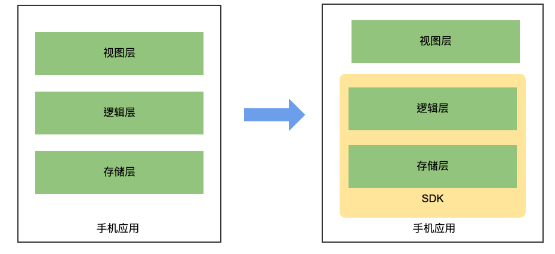

> **问题**
>
> 在手机应用的开发中，通常会将复杂的业务逻辑层实现放在服务端，客户端仅负责表现层。但是对于某些手机应用而言，业务逻辑的实现位于服务端反而是不安全的或是不合理的，而是需要将其逻辑直接在手机端实现。
>
> **目的**
>
> 面对不同系统的手机客户端，单独重复实现相同的业务逻辑，并非最佳实践。如何通过第三方语言 Go 语言将业务逻辑封装成库的形式，并以静态打包的方式提供给不同系统的手机客户端使用，是本次调研的目的。

理想目标图：

具体调研内容包括:

- [x] [iOS 应用实现 gRPC 调用](/go-mobile-research-01/)
- [x] [Android 应用实现 gRPC 调用](/go-mobile-research-02/)
- [x] [GoMobile SDK 在 iOS & Android 上的集成](/go-mobile-research-03/)
- [x] [GoMobile SDK 在 iOS & Android 上的边界](/go-mobile-research-03/)
- [ ] C/S 架构 or 静态库

其中关于 gRPC 在 iOS 与 Android 的实现，本身官方就已经提供了样例。本次调研会用到相关内容，所以将其作为调研的一部分记录下来，方便后来者阅读。调研中所有涉及的项目代码均存放于: [liujianping/grpc-apps](https://github.com/liujianping/grpc-apps) 仓库中， 需要的朋友可以直接下载测试。

