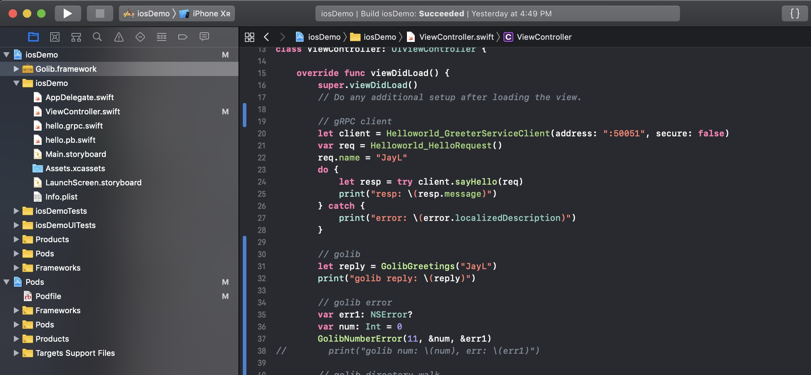

> **问题**
>
> 在手机应用的开发中，通常会将复杂的业务逻辑层实现放在服务端，客户端仅负责表现层。但是对于某些手机应用而言，业务逻辑的实现位于服务端反而是不安全的或是不合理的，而是需要将其逻辑直接在手机端实现。
>
> **目的**
>
> 面对不同系统的手机客户端，单独重复实现相同的业务逻辑，并非最佳实践。如何通过第三方语言 Go 语言将业务逻辑封装成库的形式，并以静态打包的方式提供给不同系统的手机客户端使用，是本次调研的目的。

理想目标图：


具体调研内容包括:

- [x] [iOS 应用实现 gRPC 调用](/go-mobile-research-01/)
- [x] [Android 应用实现 gRPC 调用](/go-mobile-research-02/)
- [x] [GoMobile SDK 在 iOS & Android 上的集成](/go-mobile-research-03/)
- [x] [GoMobile SDK 在 iOS & Android 上的边界](/go-mobile-research-03/)
- [ ] C/S 架构 or 静态库

其中关于 gRPC 在 iOS 与 Android 的实现，本身官方就已经提供了样例。本次调研会用到相关内容，所以将其作为调研的一部分记录下来，方便后来者阅读。调研中所有涉及的项目代码均存放于: [liujianping/grpc-apps](https://github.com/liujianping/grpc-apps) 仓库中， 需要的朋友可以直接下载测试。

## 1. 环境安装

### 1.1 GoMobile 工具安装

首先保证开发环境处于"全球通"状态，保证顺利安装相关依赖包与工具。

> 注意： GoMobile 不支持最新的 Go Module 包依赖功能，所以建议在开始本教程之前, 执行 `export GO111MODULE=off` 关闭 Go Module 功能。

通过以下命令直接源码安装

````bash
$: go get golang.org/x/mobile/cmd/gomobile 
$: gomobile -h
Usage:

	gomobile command [arguments]

Commands:

	bind        build a library for Android and iOS
	build       compile android APK and iOS app
	clean       remove object files and cached gomobile files
	init        build OpenAL for Android
	install     compile android APK and install on device
	version     print version
````
从命令输出能够看出，gomobile 能够通过子命令`build`直接构建不同系统的客户端应用，还可以通过子命令`bind`构建支持不同系统的开发库。基于本次调研的目的，主要使用`bind`子命令生成相应平台的SDK。

### 1.2 iOS 工具安装

XCode 安装是必备的，请参考:[iOS 应用实现 gRPC 调用](/go-mobile-research-01/)。

如果使用`gomobile`生成 iOS SDK，还需要安装`Command Line Tools for XCode`工具, 直接通过开发者账号登录苹果[官网](https://developer.apple.com/download/more/)上下载.

安装完成后执行：

````bash
$: xcode-select -s /Applications/Xcode.app/
````

### 1.3 Android 工具安装

Android Studio 安装是必备的，请参考:[Android 应用实现 gRPC 调用](/go-mobile-research-02/)。

如果使用`gomobile`生成 Android SDK，还需要安装 Android NDK 环境。未安装时会报以下错误：

````bash
$: gomobile bind -target=android github.com/liujianping/golib
gomobile: no Android NDK found in $ANDROID_HOME/ndk-bundle nor in $ANDROID_NDK_HOME
````

打开 Android Studio，进入Tools > Android > SDK Manager 勾选安装：

- [x] LLDB
- [x] CMAKE
- [x] NDK

过程有点慢，耐心等待。完成安装后，设置环境变量即可。 

````bash
export ANDROID_HOME=~/Library/Android/sdk/
export ANDROID_NDK_HOME=$ANDROID_HOME/ndk-bundle
````

## 2. Go SDK 样例实现

在官方的[GoMobile/Wiki](https://github.com/golang/go/wiki/Mobile)上，安装包内就已经提供了最简单的样例代码了，可以直接使用。因为是现成的代码，缺少过程，所以这里还是从头开始创建，记录过程。

### 2.1 Golib 实现

首先创建一个新的本地 Go 项目：`Golib`, 具体代码放在[Golib](https://github.com/liujianping/golib)中。

````bash
$: mkdir -p $GOPATH/src/github.com/liujianping/golib
$: cd $GOPATH/src/github.com/liujianping/golib
$: cat <<EOF > golib.go
package golib

import (
	"errors"
	"fmt"
)

func Greetings(name string) string {
	return fmt.Sprintf("Hello, %s!", name)
}

func NumberError(num int) (int, error) {
	if num >= 10 {
		return 0, errors.New("num > 10")
	}
	return num, nil
}
EOF

````

这个样例程序比官方的多了一个函数`NumberError`实现。因为真实项目一定会存在异常处理，所以增加这个函数顺便调研一下。

如果前一节的环境全部都安装成功的话，现在我们就可以生成相应平台的SDK了。

### 2.2 生成 iOS SDK

生成 iOS SDK 过程很简单：

````bash
$: gomobile bind -target=ios github.com/liujianping/golib
$: ls
Golib.framework  golib.go  
````

完成命令后，在当前目录下就生成了`Golib.framework`的目录，当然也可以通过指定`-o`设置输出路径。

### 2.3 生成 Andorid SDK

Android SDK 的生成过程，同样很简单：

````bash
$: gomobile bind -target=android github.com/liujianping/golib
$: ls
golib-sources.jar  golib.aar  Golib.framework  golib.go  
````

不同的是，android 平台生成的是 `jar` 与 `arr` 两个包。具体 `jar` 与 `arr` 包的区别，贴下 google 的结果：

> The main difference between a Jar and a AAR is that AARs include resources such as layouts, drawables etc. This makes it a lot easier to create self-contained visual components. 

## 3. GoMobile SDK 的集成

### 3.1 在 iOS 上集成

打开[iOS 应用实现 gRPC 调用](/go-mobile-research-01/)中创建的项目，将`Golib.framework`拖拽到项目中。



打开`ViewController.swift`文件：

````swift
import UIKit
import Golib


class ViewController: UIViewController {

    override func viewDidLoad() {
        super.viewDidLoad()
        // Do any additional setup after loading the view.
        
        // gRPC client
        ...
        
        // golib
        let reply = GolibGreetings("JayL")
        print("golib reply: \(reply)")

        // golib error
        var err1: NSError?
        var num: Int = 0
        GolibNumberError(11, &num, &err1)
        print("golib num: \(num), err: \(err1)")
    }

}
````

重新编译并执行测试项目，在控制台输出得出预期结果。完成 iOS 上集成 GoMobile SDK的集成。

### 3.2 在 Android 上集成

在 Android 上集成没有 iOS 上拖拽那么简单， 可以按以下步骤通过新建一个新Module的方式将 Golib SDK 导入到项目中。

打开[Android 应用实现 gRPC 调用](/go-mobile-research-02/)中创建的项目，执行 `File -> New -> NewModule`菜单创建一个新的 Module golib。再打开 `Module: app`的`Gradle`文件，引入 `Module: golib`， 即增加项目依赖: `implementation project(":golib")`。如下图：


完成上面步骤，就可以在代码中引用该 SDK 了。 打开主实现 java 文件:

````java
	String goLib_hello = Golib.greetings("GoLib Hello");
	Log.i("golib", goLib_hello);

	try {
		long l = Golib.numberError(11);
		Log.i("golib", Long.toString(l));
	}
	catch (Exception e) {
		Log.e("golib", e.getMessage());
	}
````
设置不同的`Golib.numberError(11)`输入参数，查看控制台的输出情况。完成 Android 上集成 GoMobile SDK的集成。

## 4. GoMobile SDK 功能边界

完成了 GoMobile SDK 的集成工作， 现在看看它能做什么。

### 4.1 日志打印

在 GoMobile SDK 上的日志输出是否可以正常的在 iOS 与 Android 平台正常输出，不妨在 Golib 的实现上增加 `log.Println` 输出。

通过验证，GoMobile SDK 上的日志输出在 iOS 与 Android 上可以正常输出。有了日志输出就可以非常方便的调试 GoMobile SDK 的具体功能了。

### 4.2 文件系统

不同的手机系统平台，第三方应用的文件目录存储路径不一样的。所以，具体路径还是让上层调用代码作为参数传入比较合理。

在 golib 实现库中增加目录枚举函数，并增加日志:

````golang
package golib

import (
	"fmt"
	"log"
	"os"
	"path/filepath"
)

func WalkDirectory(path string) error {
	return filepath.Walk(path, func(path string, info os.FileInfo, err error) error {
		if err != nil {
			log.Println("walk fn failed: ", err)
			return err
		}
		log.Printf("walked file or dir: %q\n", path)
		return nil
	})
}
````
重新编译生成对应平台的SDK，再集成测试。

### 4.3 数据存储

大部分手机应用的本地数据存储都会使用`sqlite`数据库来实现。所以就`sqlite`再GoMobile SDK 中的实现进行调研。

````bash
$: get get github.com/mattn/go-sqlite3
````

可以直接取`github.com/mattn/go-sqlite3`封装其中的样例代码进行实验。具体代码请参考：[golib/sqlite.go](https://github.com/liujianping/golib/blob/master/sqlite.go)。

编译重新集成测试可知，在 GoMobile SDK在 iOS/Android实现 sqlite 的功能可行。

### 4.4 网络操作

网络操作是最不需要验证的功能了，SDK 中完全可以将手机应用的网络操作全部封装到其中。

## 小结

本文仅仅是对 GoMobile SDK 在集成与边界的初步验证，提供一套解决手机应用混合编程的新思路。虽然能够完成本次调研的预期目的，但是如果需要用于生产环境中，请进行更多的功能验证。


