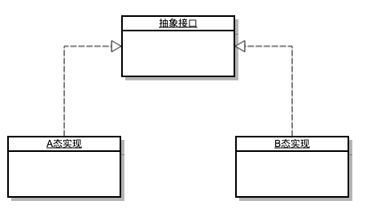

说起**条件编译**，大部分开发人员都会联想到**交叉编译**。但是 **条件编译** 和 **交叉编译** 完全是两回事， 解决的问题也是不一样的。总结区分一下：

- **交叉编译**，解决的是目标程序问题, 是**目的**。
- **条件编译**，解决的是代码适配问题, 是**过程**。

## 交叉编译

交叉编译解决目标程序问题,即在一台具体的系统环境下编译出不同系统或不同语言环境的目标程序。举个简单的例子，在一台任意操作系统的机器上，编译出不同系统的目标程序：

````bash
# 以平台 linux 作为目标编译平台
$: GOOS=linux go build 
# 以平台 darwin 作为目标编译平台
$: GOOS=darwin go build 
# 以平台 windows 作为目标编译平台
$: GOOS=windows go build 
````

当然交叉编译不仅仅是可以根据目的操作系统进行编译，还可以区分系统的CPU架构类型，以及不同的语言版本，甚至可以指定用户自定义的编译标签，按自定义的方式编译目标程序。

更复杂的交叉编译参数如下:

````bash
$: GOOS=${GOOS} GOARCH=${GOARCH} go build -tags ...
````

**交叉编译**程序是否是按照预期进行编译，可以通过`go list`命令进行验证。不防先熟悉下该命令：

````bash
# linux 
$: GOOS=linux go list -f '{{.GoFiles}}' os/exec
[exec.go exec_unix.go lp_unix.go]

# darwin
$: GOOS=darwin go list -f '{{.GoFiles}}' os/exec
[exec.go exec_unix.go lp_unix.go]

# windows
$: GOOS=windows go list -f '{{.GoFiles}}' os/exec
[exec.go exec_windows.go lp_windows.go]
````

可以看出，这个命令能够快速回答我们按当前的目标平台编译时，编译所需要的代码文件。有了这个利器，就可以很方便的开始**条件编译**的话题了。

## 条件编译

条件编译解决的是一份代码在不同的编译平台以及不同的语言版本的兼容性问题，即一份代码处处都可以编译。Go 语言中的条件编译的方式，可直接官方提供的文档: [Build Constraints](https://golang.org/pkg/go/build/#hdr-Build_Constraints).总结下来就是两种方式：

### 文件名后缀方式

`go build` 在不读取源文件的情况下可以通过文件名后缀以决定哪些文件参与编译，哪些不需要。文件名后缀的形式，主要有：

- `_$GOOS.go`
- `_$GOARCH.go`
- `_$GOOS_$GOARCH.go` 

最后一种组合后缀，顺序不能颠倒。

### 编译标签标注方式

更加灵活的条件编译方式，是通过在文件头增加**条件编译标签**。条件标签在使用上需要和常规注释进行区分。

条件编译标签的格式: `// +build` 前缀开始，条件编译标签必须和普通的注释以及代码通过空行分隔开来。否则，编译器就无法认出。

条件编译具体条件组合的规则，总结出来就是：

````
空格 ' ' = OR
逗号 ',' = AND
感叹号 '!' = NOT
换行 = OR
````

官网例子：

````
// +build linux,386 darwin,!cgo
````
条件编译组合结果是： `(linux AND 386) OR (darwin AND (NOT cgo))`

````
// +build linux darwin
// +build 386
````
条件编译组合结果是：`(linux OR darwin) AND 386`

具体条件则可以有：

- 操作系统, 值可以通过 `runtime.GOOS` 获取
- CPU架构, 值可以通过 `runtime.GOARCH` 获取
- 编译器，如 `gc`, `gccgo`
- 是否开启Cgo， `cgo`
- 语言版本, Go版本如 `go1.1`,...,`go1.12`
- 自定义标签, 任意标签，可以是发布版本号，开发版本等等

## 现实问题

不论是`交叉编译`还是`条件编译`，终归是为了解决问题。`交叉编译`解决发布问题，`条件编译`解决代码问题。两种都很重要，此节仅就代码问题进行说明，即**如何保证一份代码在不同编译条件下能够通用**。

其实这是一个编程领域的经典问题，即**多态**。既然是多态问题，就可以通过常说的OOP中的多态来实现， 即对多态进行抽象，再进行具体实现。



看一个例子[pkg/profile](https://github.com/pkg/profile)：

在代码实现中有两个 trace 实现文件， 分别是: `trace.go` 与 `trace16.go`. 其中用到了 `runtime/trace` 包，而该包是在 `Go 1.7` 版本中新引入的。所以作者定义了一个统一的抽象函数，具体实现则通过条件编译，在不同的版本中提供具体的实现。对`Go 1.7`以下的版本则采用空实现的方式。

贴一下代码看看，`trace.go`针对 `Go 1.7`版本以及后续版本的实现：

````go
// +build go1.7

package profile

import "runtime/trace"

var startTrace = trace.Start
var stopTrace = trace.Stop
````

再看看 `trace16.go` 的实现:

````go
// +build !go1.7

package profile

import "io"

// mock trace support for Go 1.6 and earlier.

func startTrace(w io.Writer) error { return nil }
func stopTrace()                   {}
````

问题怎么解决的，应该不用解释了。