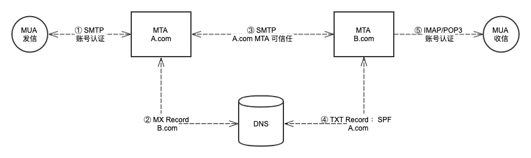
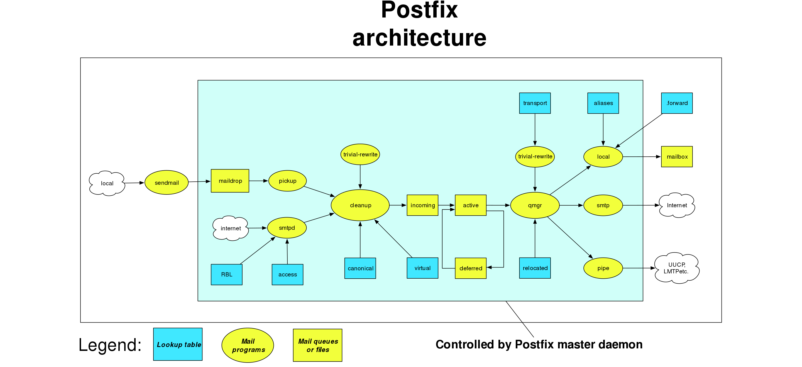

没想到自己这么多年以后，还会再次与邮件系统相遇。趁此机会，将年轻时落下的功课补上。

# 1. 邮件基础

## 1.1 收发原理



## 1.2 SMTP 协议

## 1.3 IMAP 协议

## 1.4 Exchange 协议

# 2. 邮箱系统

# 3. Postfix 





## 3.1 收信配置

### 3.1.1 基础设置

基础配置主要包括:

- 监听配置

````
inet_interfaces  (default: all)
inet_protocols   (default: all)
````

- 主机配置
````
myhostname: 主机名配置, `$myhostname`, 会用于 `helo` 命令的返回。如果没有设置的话，是 `gethostname().$mydomain` .
````
- 域名配置

````
mydomain: 
````

### 3.1.2 信任设置

- 网络信任


- 发件人信任
- 收件人信任

### 3.1.3 配额设置

- 单邮件最多收件
- 单邮件正文大小

### 3.1.4 反垃圾配置


邮件系统在互联网上提供服务的域名: `$mydomain`, 该变量配置会被很多其它配置引用。

可靠网络配置： `$mynetworks`, 在该网络变量中投递过来的邮件均为可信任邮件。

设置收件验证， 验证条件：

- 发件服务器确认：
  `smtpd_helo_required = yes`
  `smtpd_helo_restrictions = permit_mynetworks, reject_unknown_helo_hostname`
- 每封邮件只能有一个收件人 smtp_destination_recipient_limit = 1
- 收件人地址必须存在 
- 邮件大小不超过 < 10mb

## 3.2 发信配置

邮件投递出去的所属域名：`$myorigin` ， 用于 `smtp` 远程投递进程

邮件本地投递的所属域名：`$mydestination` ， 用于 `local` 等本地投递进程

# Postfix 订阅代理

只接受具体邮箱地址的邮件，不做转发服务器。


## 配置说明


# 参考资料

[直接处理投递本地邮件](http://www.postfix.org/MAILDROP_README.html#direct)