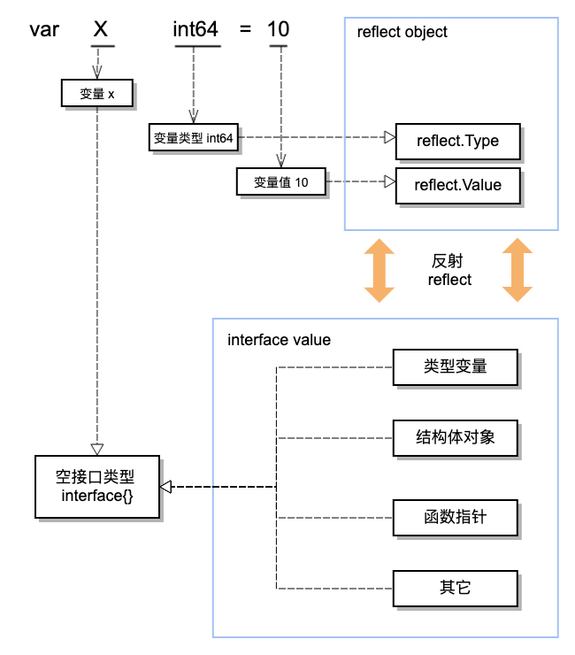

## 1. 图解反射

在使用反射之前，此文[The Laws of Reflection](https://blog.golang.org/laws-of-reflection)必读。网上中文翻译版本不少，可以搜索阅读。

开始具体篇幅之前，先看一下反射三原则：

- Reflection goes from interface value to reflection object.
- Reflection goes from reflection object to interface value.
- To modify a reflection object, the value must be settable.

在三原则中，有两个关键词 `interface value` 与 `reflection object`。有点难理解，画张图可能你就懂了。



先看一下什么是**反射对象** `reflection object`？ 反射对象有很多，但是其中最关键的两个反射对象`reflection object`是：`reflect.Type`与`reflect.Value`.直白一点，就是对变量`类型`与`值`的抽象定义类，也可以说是变量的元信息的类定义.

再来，为什么是**接口变量值** `interface value`, 不是变量值 `variable value` 或是对象值 `object value` 呢？因为后两者均不具备广泛性。在 Go 语言中，空接口 `interface{}`是可以作为一切类型值的通用类型使用。所以这里的接口值 `interface value` 可以理解为**空接口变量值** `interface{} value`。

结合图示，将反射三原则归纳成一句话：

> 通过反射可以实现**反射对象** `reflection object`与**接口变量值** `interface value`之间的相互推导与转化, 如果通过反射修改对象变量的值，前提是对象变量本身是`可修改`的。

## 2. 反射的应用

在程序开发中是否需要使用反射功能，判断标准很简单，即是否需要用到变量的类型信息。这点不难判断，**如何合理的使用反射**才是难点。因为，反射不同于普通的功能函数，它对程序的性能是有损耗的，需要尽量避免在高频操作中使用反射。

举几个反射应用的场景例子:

### 2.1 判断未知对象是否实现具体接口

通常情况下，判断未知对象是否实现具体接口很简单，直接通过 `变量名.(接口名)` 类型验证的方式就可以判断。但是有例外，即框架代码实现中检查调用代码的情况。因为框架代码先实现，调用代码后实现，也就无法在框架代码中通过简单额类型验证的方式进行验证。

看看 `grpc` 的服务端注册接口就明白了。

````go
grpcServer := grpc.NewServer()
// 服务端实现注册
pb.RegisterRouteGuideServer(grpcServer, &routeGuideServer{})
````
当注册的实现没有实现所有的服务接口时，程序就会报错。它是如何做的，可以直接查看`pb.RegisterRouteGuideServer`的实现代码。这里简单的写一段代码，原理相同：

````go

//目标接口定义
type Foo interface {
	Bar(int)
}
  
dst := (*Foo)(nil)
dstType := reflect.TypeOf(dst).Elem()

//验证未知变量 src 是否实现 Foo 目标接口
srcType := reflect.TypeOf(src)
if !srcType.Implements(dstType) {
		log.Fatalf("type %v that does not satisfy %v", srcType, dstType)
}
````

这也是`grpc`框架的基础实现，因为这段代码通常会是在程序的启动阶段所以对于程序的性能而言没有任何影响。

### 2.2 结构体字段属性标签

通常定义一个待JSON解析的结构体时，会对结构体中具体的字段属性进行`tag`标签设置，通过`tag`的辅助信息对应具体JSON字符串对应的字段名。JSON解析就不提供例子了，而且通常JSON解析代码会作用于请求响应阶段，并非反射的最佳场景，但是业务上又不得不这么做。

这里我要引用另外一个利用**结构体字段属性标签**做反射的例子，也是我认为最完美诠释反射的例子，真的非常值得推荐。这个例子出现在开源项目`github.com/jaegertracing/jaeger-lib`中。

用过 `prometheus`的同学都知道，`metric`探测标量是需要通过以下过程定义并注册的：

````go
var (
	// Create a summary to track fictional interservice RPC latencies for three
	// distinct services with different latency distributions. These services are
	// differentiated via a "service" label.
	rpcDurations = prometheus.NewSummaryVec(
		prometheus.SummaryOpts{
			Name:       "rpc_durations_seconds",
			Help:       "RPC latency distributions.",
			Objectives: map[float64]float64{0.5: 0.05, 0.9: 0.01, 0.99: 0.001},
		},
		[]string{"service"},
	)
	// The same as above, but now as a histogram, and only for the normal
	// distribution. The buckets are targeted to the parameters of the
	// normal distribution, with 20 buckets centered on the mean, each
	// half-sigma wide.
	rpcDurationsHistogram = prometheus.NewHistogram(prometheus.HistogramOpts{
		Name:    "rpc_durations_histogram_seconds",
		Help:    "RPC latency distributions.",
		Buckets: prometheus.LinearBuckets(*normMean-5**normDomain, .5**normDomain, 20),
	})
)

func init() {
	// Register the summary and the histogram with Prometheus's default registry.
	prometheus.MustRegister(rpcDurations)
	prometheus.MustRegister(rpcDurationsHistogram)
	// Add Go module build info.
	prometheus.MustRegister(prometheus.NewBuildInfoCollector())
}

````

这是 `prometheus/client_golang` 提供的例子，代码量多，而且需要使用`init`函数。项目一旦复杂，可读性就很差。再看看`github.com/jaegertracing/jaeger-lib/metrics`提供的方式：

````go
type App struct{
    //attributes ...
    //metrics ...
    metrics struct{
        // Size of the current server queue
    		QueueSize metrics.Gauge `metric:"thrift.udp.server.queue_size"`
    
    		// Size (in bytes) of packets received by server
    		PacketSize metrics.Gauge `metric:"thrift.udp.server.packet_size"`
    
    		// Number of packets dropped by server
    		PacketsDropped metrics.Counter `metric:"thrift.udp.server.packets.dropped"`
    
    		// Number of packets processed by server
    		PacketsProcessed metrics.Counter `metric:"thrift.udp.server.packets.processed"`
    
    		// Number of malformed packets the server received
    		ReadError metrics.Counter `metric:"thrift.udp.server.read.errors"`
    }
}
````

在应用中首先直接定义匿名结构`metrics`， 将针对该应用的`metric`探测标量定义到具体的结构体字段中，并通过其字段标签`tag`的方式设置名称。这样在代码的可读性大大增强了。

再看看初始化代码:

````go
import "github.com/jaegertracing/jaeger-lib/metrics/prometheus"

//初始化
metrics.Init(&app.metrics, prometheus.New(), nil)
````

不服不行，完美。这段样例代码实现在我的这个项目中: [x-mod/thriftudp](https://github.com/x-mod/thriftudp)，完全是参考该库的实现写的。


### 2.3 函数适配

原来做练习的时候，写过一段函数适配的代码，用到反射。贴一下：

````go
//Executor 适配目标接口，增加 context.Context 参数
type Executor func(ctx context.Context, args ...interface{})

//Adapter 适配器适配任意函数
func Adapter(fn interface{}) Executor {
	if fn != nil && reflect.TypeOf(fn).Kind() == reflect.Func {
		return func(ctx context.Context, args ...interface{}) {
			fv := reflect.ValueOf(fn)
			params := make([]reflect.Value, 0, len(args)+1)
			params = append(params, reflect.ValueOf(ctx))
			for _, arg := range args {
				params = append(params, reflect.ValueOf(arg))
			}
			fv.Call(params)
		}
	}
	return func(ctx context.Context, args ...interface{}) {
		log.Warn("null executor implemention")
	}
}
````
仅仅为了练习，生产环境还是不推荐使用，感觉太重了。

最近看了一下`Go 1.14`的提案，关于`try`关键字的引入, [try参考](https://golang.org/design/32437-try-builtin)。按其所展示的功能，如果自己实现的话，应该会用到反射功能。那么对于现在如此依赖 `error` 检查的函数实现来说，是否合适,挺怀疑的，等`Go 1.14`出了，验证一下。

## 3 小结

反射的最佳应用场景是程序的启动阶段，实现一些类型检查、注册等前置工作，既不影响程序性能同时又增加了代码的可读性。最近迷上新裤子，所以别再问我什么是反射了：）

## 参考资源:

- [The Laws of Reflection](https://blog.golang.org/laws-of-reflection)
- [Go Data Structures: Interfaces](https://research.swtch.com/interfaces)