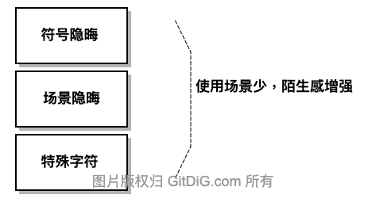

本篇作为 Go 编程“边角料”的最后一篇，主要针对 Go 语言提供的操作符进行一次总结。刚好回应上篇一位读者关于表达式是否要加'.'的问题做个回复。

在 Go 语言中，一共提供了47个操作符，包括标点符号。摘自[官方文档](https://golang.org/ref/spec#Operators_and_punctuation)，分别是：

````go
+    &     +=    &=     &&    ==    !=    (    )
-    |     -=    |=     ||    <     <=    [    ]
*    ^     *=    ^=     <-    >     >=    {    }
/    <<    /=    <<=    ++    =     :=    ,    ;
%    >>    %=    >>=    --    !     ...   .    :
     &^          &^=
````

除以上操作符以外，在 Go 语言中还有一个特殊的符号 `_`， 以及一个非 Go 语言操作符的特殊字节`?`。

刨去一些常用的操作符，对其中较隐晦操作符做个简单的备注，方便不时之需。
就隐晦本身而言，可通过图示简单分类：



## 1. 符号隐晦

上文中的 47 个操作符，一个个看下来，真正隐晦的符号基本上都是位运算操作符或相关操作符。
之所以隐晦，因为位运算在大部分开发人员的日常开发中属于非常规操作，因为运用得少，而增加了其陌生感。不妨简单罗列一下：

````
&    bitwise AND            integers     
|    bitwise OR             integers    
^    bitwise XOR            integers    
&^   bit clear (AND NOT)    integers  

<<   left shift             integer << unsigned integer
>>   right shift            integer >> unsigned integer
````

写个简单的例子, 强化记忆:

````go
package main

import "fmt"

func main(){
  fmt.Printf("AND: a(%b) & b(%b) = (%b)\n", 4, 5, (4 & 5))
  fmt.Printf("OR:  a(%b) | b(%b) = (%b)\n", 4, 5, (4 | 5))
  fmt.Printf("XOR: a(%b) ^ b(%b) = (%b)\n", 4, 5, (4 ^ 5))
  fmt.Printf("AND NOT: a(%b) &^ b(%b) = (%b)\n", 4, 5, (4 &^ 5))

  fmt.Printf("Left Shift:  a(%b) << 1 = (%b)\n", 5, (5 << 1))
  fmt.Printf("Right Shift: a(%b) >> 1 = (%b)\n", 5, (5 >> 1))
}
````
输出的结果是:

````
AND: a(100) & b(101) = (100)
OR:  a(100) | b(101) = (101)
XOR: a(100) ^ b(101) = (1)
AND NOT: a(100) &^ b(101) = (0)
Left Shift:  a(101) << 1 = (1010)
Right Shift: a(101) >> 1 = (10)
````

位操作符并不难，之所以隐晦，主要是实际运用的少导致的。其中，XOR 运算有个特点：如果对一个值连续做两次 XOR，会返回这个值本身。XOR 的这个特点，使得它可以用于信息的加密。阮一峰这篇文章[XOR 加密简介](http://www.ruanyifeng.com/blog/2017/05/xor.html)很好读。

与位运算符相关的符号，有：

````
<<=    >>=    &=    ^=   |=
````

其功能与`+=`是一样的，即 `a += 1` 等同于 `a = a + 1`。

## 2. 场景隐晦

另一类操作符，看似非常简单，但因其在不同应用场景下产生了不同功能效果，导致在使用上的陌生。

### 2.1 符号 '_'

符号 '_', 又称为**空标识符**(Blank identifier)。它有两种使用场景，不同场景提供的功能是不同的.

- 作为匿名变量赋值使用

此时符号 '_', 功能与 `/dev/null` 类似，只负责接收值并直接丢弃，无法取回。 

````go
ar := [10]int{1,2,3,4,5,6,7,8,9,0}
for _, v := range ar {
	println(v)
}
````

- 在包引用时使用

常规情况下，包引用格式是这样的:

````go
package YourPackage

import   "lib/math"         //math.Sin
import m "lib/math"         //m.Sin
import . "lib/math"         //Sin
````
具体语法意义不解释了。现在看看 '_' 在包引入中的功能。

````go
import _ "the/third/pkg"
````
此时引入的第三方包`"the/third/pkg"`,如果引入的结果是一个空标识符'_'。按其空标识符的原始意义，就是对于使用方而言，没有任何意义，因为无法使用被引入包中任何变量或是函数。

但是，这种引用有一个副作用，就是：会对第三方包进行编译并且执行初始化`func init()`操作.这一功能，对于某些引用方就非常有用。

所以当我们研究一些开源代码时，看到类似的引用`import _ "the/third/pkg"`时，直接跳到引入包的`init`函数，就可以建立起内在逻辑。不妨看一下`github.com/golang/protobuf/protoc-gen-go/link_grpc.go`的代码， 这就是`grpc`插件注册到`protoc-gen-go`的地方。

````golang
package main

import _ "github.com/golang/protobuf/protoc-gen-go/grpc"
````

### 2.2 符号 '.'

符号 '.' 常规情况下是作为**选择器**的在使用。如：

````go
//直接选择属性名或函数名
x.FieldName
x.FunctionName
````

还可以做为**包引用**使用，如上节。

````go
import . "lib/math"         //Sin
````
它的作用有点类似当前目录符'.'的意思了，简化掉了包引用的相对路径。

还有一个用法，即**类型断言**（type assertion）。

````go
//类型断言: 类型必须用'()'括起来
v, ok := x.(T) 
````
作为**类型断言**时，类型必须用'()'括起来，防止和**选择器**功能混淆。**类型断言**与**类型转换**需要区分一下。

````go
//类型转换: 变量必须用'()'括起来
v := T(x)
````

区别：

- **类型转换**中，待转换的变量`x`只要是一个可以转换成目标类型的变量即可。失败时代码无法编译通过。
- **类型断言**中，待断言的变量`x`必须与目标类型一致。如果失败，返回`bool`参数标识。

### 2.3 符号 '...'

符号 '...' 主要用于不定参数与切片打散功能。非常简单，备注一下。

**不定参数**

````go
import "fmt"

func Foo(args ...interface{}) {
  for _, arg := range args {
    fmt.Println(arg)
  }
}
````

**切片打散**

````go
args := []interface{}{1, false, "hello"}
Foo(args...)
````

**数组长度**

````
[...]int{1,2,4}
````

## 3 特殊符号 '?', 非 Go 语言操作符

很多语言都支持符号 '?', 但是在 Go 语言中并它不属于系统操作符, 虽然在 Go 代码中经常会碰到符号 '?'。在语言级别符号 '?' 没有任何语法意义，只是一个常规的字节。

常见使用场景是做为 SQL 语句的替换符使用。如:

````go
  import "database/sql"

	id := 47
	result, err := db.ExecContext(ctx, "UPDATE balances SET balance = balance + 10 WHERE user_id = ?", id)
	if err != nil {
		log.Fatal(err)
	}
````

其中的符号 '?' 仅仅与依赖包`database/sql`有关，与 Go 语言本身无关。在`database/sql`包中，字符 '?' 可以将任意类型参数变量替换转义成 SQL 字符串合适的类型值。