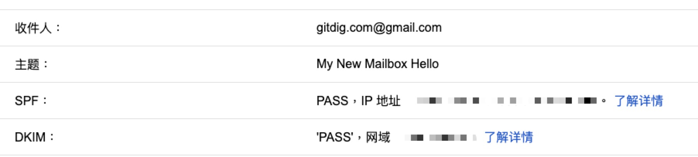

本文主要原本打算作为**9102年，再玩一次邮件系统**系列文章的中篇写的，却是最早完成的。本系列文章将包括以下三篇：

- [ ] 9102年，再玩一次邮件系统: 原理篇
- [x] [9102年，再玩一次邮件系统: 安装篇](/postfix-dovecot-in-action-02/)
- [ ] 9102年，再玩一次邮件系统: 扩展篇

因为是中篇先发，但是为了帮助读者快速对邮件系统有个全局概念，先提供一张原理图：


以下篇幅记录整个邮件系统完整的安装过程，采用`postfix + dovecot`最简化安装方案，不使用数据库。

## 1. 云服务商选择

目前国内的云服务，ECS虚机默认均不提供`25`端口，即`smtp`服务无法正常使用。当然阿里云、腾讯云均提供申请入口，可以申请开放`25`端口。问题不在这，在于`25`端口的进包解封了，`25`端口的出包仍然是受限的。国外云服务也有禁用`25`端口限制的，也有不限制的，权衡之后选择`Linode`提供的虚机服务。而且`Linode`提供了非常详细的邮件系统部署方案:

- [email-with-postfix-dovecot-and-mysql](https://www.linode.com/docs/email/postfix/email-with-postfix-dovecot-and-mysql/)

因为需要集成自己的账号系统，所以省去`MySQL`数据库，进行最简化配置。

## 2. 系统环境配置

选择`Linode 4G`方案，操作系统选择`ubuntu 19.04`。

### 2.1 主机防火墙设置

开启主机后，首先进行主机安全防火墙的设置。在`ubuntu 19.04`中，使用`ufw`工具进行防火墙设置，默认情况下，是关闭的。

````bash
$: ufw status
Status: inactive
# 查看当前监听端口
$: netstat -ltpn
````

`ufw`可以在关闭状态下设置相关安全策略，完成配置以后，再开启防火墙。安全策略设置如下:

````bash
# 当前机器监听SSH端口号: 1122
$: ufw allow 1122/tcp
# 默认进出
$: ufw default allow outgoing
$: ufw default deny incoming
# HTTP/HTTPS端口 设置证书
$: ufw allow http/tcp
$: ufw allow https/tcp
# 邮件端口
$: ufw allow smtp/tcp
$: ufw allow smtps/tcp
$: ufw allow imap/tcp
$: ufw allow imaps/tcp
$: ufw allow 995/tcp
$: ufw allow 587/tcp
# 启用防火墙， 确认SSH端口打开
$: ufw enable 
# 查询防火墙状态
$: ufw status
Status: active

To                         Action      From
--                         ------      ----
1122/tcp                   ALLOW       Anywhere
80/tcp                     ALLOW       Anywhere
443/tcp                    ALLOW       Anywhere
25/tcp                     ALLOW       Anywhere
465/tcp                    ALLOW       Anywhere
143/tcp                    ALLOW       Anywhere
993/tcp                    ALLOW       Anywhere
995/tcp                    ALLOW       Anywhere
587/tcp                    ALLOW       Anywhere
1122/tcp (v6)              ALLOW       Anywhere (v6)
80/tcp (v6)                ALLOW       Anywhere (v6)
443/tcp (v6)               ALLOW       Anywhere (v6)
25/tcp (v6)                ALLOW       Anywhere (v6)
465/tcp (v6)               ALLOW       Anywhere (v6)
143/tcp (v6)               ALLOW       Anywhere (v6)
993/tcp (v6)               ALLOW       Anywhere (v6)
995/tcp (v6)               ALLOW       Anywhere (v6)
587/tcp (v6)               ALLOW       Anywhere (v6)
````

### 2.2 域名服务设置

因为邮件服务对与`DNS`服务对深度依赖，建议将具体的域名通过设置`ns`记录的方式，将域名记录的管理代理到`Linode`上进行。完成域名代理管理后，首先设置主机域名, 样例：`mail.example.org`.

在主机上验证域名A记录解析到这台机器的`IP`上。

````bash
# 验证A记录解析
$: systemd-resolve mail.example.org
````

解析正确后，继续设置相应的MX记录：`example.org MX 10 mail.example.org`

````bash
# 验证MX记录解析
$: systemd-resolve -t mx example.org
example.org IN MX 10 mail.example.org
````

### 2.3 Host主机设置

首先，通过`hostnamectl`命令设置主机名。

````bash
$: hostnamectl set-hostname mail
````

再修改`/etc/hosts`文件, 内容如下：

````
127.0.0.1 localhost.localdomain localhost
xx.xx.xx.xx mail.example.org mail
````
其中`xx.xx.xx.xx`是主机的公网IP.

## 3. 证书安装

证书的安装通过`Let’s Encrypt`提供的自动化工具安装，参考安装指南：

- [Secure HTTP Traffic with Certbot](https://www.linode.com/docs/quick-answers/websites/secure-http-traffic-certbot/)

这里快速记录一下过程:

````bash
# 安装工具
$: apt install certbot python-certbot-nginx
# 自动化配置证书, 确认 http 端口在防火墙中打开
$: certbot --nginx
````

安装过程中，设置域名: `example.org`, 选择`Y`,自动化安装。安装完成后，证书存放于: `/etc/letsencrypt/live/example.org/` 目录。

## 4. 邮件系统

最简化安装方案`Postfix + Dovecot`，主要是利用：

- `postfix` 服务主要提供 `smtp` 服务，将接收的邮件投递到指定用户账号对应的`maildir`格式的目录中；
- `dovecot` 服务主要提供 `imap` 服务，通过读取指定用户账号对应的`maildir`格式的目录中的邮件，通过`imap`协议的方式与用户客户端进行交互；
- 同时，用户客户端在收发阶段的认证，均通过`dovecot sasl`提供的认证方式进行认证。

### 4.1 服务安装

安装必要的工具包：

````bash
$: apt-get install postfix dovecot-core dovecot-imapd dovecot-pop3d dovecot-lmtpd
````
具体安装包的版本信息可以通过`apt show [pkgname]`进行查询。在安装 `Postfix` 过程中，按提示选择邮件服务器类型: `internet site`, 同时设置主机`FQDN`域名: `example.org`即可。 

安装完成后，`Postfix` 与 `Dovecot` 相关服务就全启动了。可以通过`netstat -ltpn`查看监听端口信息。

### 4.2 maildir 准备

`maildir` 作为 `postfix` 与 `dovecot` 服务的存储中介，提供邮件的存储功能。最简化配置不考虑多`MTA`所需要的分布式存储方案。在本机设置`maildir`存储目录与相关权限设置即可。

````bash
# 创建目录
$: mkdir -p /var/mail/vhosts/example.org

# 权限设置
$: groupadd -g 5000 vmail
$: useradd -g vmail -u 5000 vmail -d /var/mail
$: chown -R vmail:vmail /var/mail
````

### 4.3 邮箱账号

除了邮件存储以外，另外一个关键数据的准备就是邮箱账号了.无论是`postfix`还是`dovecot`都提供了灵活的访问接口，方便不同的使用者集成自己的邮箱账号体系。

#### 4.3.1 postfix 数据准备

在 `postfix` 中如何集成外部数据，其提供了一二十种集成方式。具体支持的集成方式，可以通过如下命令查询：

````bash
$: postconf -m
btree
cidr
environ
fail
hash
inline
internal
memcache
nis
pipemap
proxy
randmap
regexp
socketmap
static
tcp
texthash
unionmap
unix
````
这些集成方式，如何集成，则可以参考文档: [Postfix Lookup Table Overview](http://www.postfix.org/DATABASE_README.html)。

这里我们使用最简单的集成方式：`hash`，也即文件的方式进行账号数据准备。需要准备虚拟邮箱账号数据包括：

- 虚拟域名列表
- 虚拟邮箱账号列表
- 虚拟邮箱别名列表

现在分别准备最简单的数据：

````bash
# 切换到 /etc/postfix 目录
$: cd /etc/postfix

# 虚拟域名列表 格式: <domain><space><value>
$: cat <<EOF > /etc/postfix/virtual_domains
example.org OK
EOF

# 虚拟邮箱账号列表 格式: <mailbox><space><maildir path> 
$: cat <<EOF > /etc/postfix/virtual_mailboxes
admin@example.org example.org/admin/
foo@example.org example.org/foo/
bar@example.org example.org/bar/
EOF

# 虚拟邮箱别名列表 格式: <alias-mailbox><space><mailbox>
$: cat <<EOF > /etc/postfix/virtual_aliases
postmaster@example.org  admin@example.org
EOF
````

数据准备完了，现在对以上文件进行`hash`处理。处理命令如下:

````bash
$: cd /etc/postfix
$: postmap /etc/postfix/virtual_domains
$: postmap /etc/postfix/virtual_mailboxes
$: postmap /etc/postfix/virtual_aliases
````

完成后，目录下增加了三个文件: `virtual_domains.db`,`virtual_mailboxes.db`,`virtual_aliases.db`.
再通过`postmap`命令进行查询验证，

````bash
$: cd /etc/postfix
$: postmap -q "foo@example.org" virtual_mailboxes
example.org/foo/
````
验证成功。其它类型的数据集成方式也可以通过该命令进行查询， 专门写了一个小项目[tcp-lookup](https://github.com/liujianping/tcp-lookup)，可以作为本地进行`tcp`方式集成数据的基础服务进行扩展。

#### 4.3.2 dovecot 数据准备

在 `dovecot` 中，数据集成可以参考官方文档：[PasswordDatabase](https://wiki2.dovecot.org/PasswordDatabase).既然是最简安装，就使用最简单的方式集成数据。在 `dovecot` 中需要集成的数据有：

- 虚拟账号密码信息
- 虚拟账号存储信息

同样，采用文件的方式进行数据准备。先准备账号密码数据，采用`Passwd-file`的方式进行准备：

````bash
$: cd /etc/dovecot
$: cat <<EOF > /etc/dovecot/virtal-mailbox-passwd
admin@example.org:{PLAIN}admin::::::
foo@example.org:{PLAIN}123456::::::
bar@example.org:{PLAIN}654321::::::
EOF
````
至于账号存储数据，在`dovecot`中可以直接进行`static`静态配置。具体参见`dovecot 配置`章节。

### 4.4 postfix 配置

`postfix`主要提供邮件接收服务，同时将本地邮件投递到用户账号下的`maildir`格式的目录中。由于历史原因，`postfix`最开始是为本机系统账号`Unix Account`开发的，后来才开始支持虚拟账号`Virtual Account`， 即在本机没有对应的系统账号。官方最简化配置请参考: [virtual_mailbox](http://www.postfix.org/VIRTUAL_README.html#virtual_mailbox)。

这里还是使用`Linode`提供的配置，对于邮件系统而言更加完整，增加了必要的反垃圾策略并且加上了`dovecot sasl`认证功能，仅仅就`MySQL`用户账户相关的数据进行重新配置。以下记录下配置过程：

````bash
# 备份默认配置
$: cp /etc/postfix/main.cf /etc/postfix/main.cf.orig
````
编辑`/etc/postfix/main.cf`内容如下:

````bash
# See /usr/share/postfix/main.cf.dist for a commented, more complete version

# Debian specific:  Specifying a file name will cause the first
# line of that file to be used as the name.  The Debian default
# is /etc/mailname.
#myorigin = /etc/mailname

smtpd_banner = $myhostname ESMTP $mail_name (Ubuntu)
biff = no

# appending .domain is the MUA's job.
append_dot_mydomain = no

# Uncomment the next line to generate "delayed mail" warnings
#delay_warning_time = 4h

readme_directory = no

# TLS parameters
smtpd_tls_cert_file=/etc/letsencrypt/live/example.org/fullchain.pem
smtpd_tls_key_file=/etc/letsencrypt/live/example.org/privkey.pem
smtpd_use_tls=yes
smtpd_tls_auth_only = yes
smtp_tls_security_level = may
smtpd_tls_security_level = may
smtpd_sasl_security_options = noanonymous, noplaintext
smtpd_sasl_tls_security_options = noanonymous

# Authentication
smtpd_sasl_type = dovecot
smtpd_sasl_path = private/auth
smtpd_sasl_auth_enable = yes

# See /usr/share/doc/postfix/TLS_README.gz in the postfix-doc package for
# information on enabling SSL in the smtp client.

# Restrictions
smtpd_helo_restrictions =
        permit_mynetworks,
        permit_sasl_authenticated,
        reject_invalid_helo_hostname,
        reject_non_fqdn_helo_hostname
smtpd_recipient_restrictions =
        permit_mynetworks,
        permit_sasl_authenticated,
        reject_non_fqdn_recipient,
        reject_unknown_recipient_domain,
        reject_unlisted_recipient,
        reject_unauth_destination
smtpd_sender_restrictions =
        permit_mynetworks,
        permit_sasl_authenticated,
        reject_non_fqdn_sender,
        reject_unknown_sender_domain
smtpd_relay_restrictions =
        permit_mynetworks,
        permit_sasl_authenticated,
        defer_unauth_destination

# See /usr/share/doc/postfix/TLS_README.gz in the postfix-doc package for
# information on enabling SSL in the smtp client.

myhostname = example.org
alias_maps = hash:/etc/aliases
alias_database = hash:/etc/aliases
mydomain = example.com
myorigin = $mydomain
mydestination = localhost
relayhost =
mynetworks = 127.0.0.0/8 [::ffff:127.0.0.0]/104 [::1]/128
mailbox_size_limit = 0
recipient_delimiter = +
inet_interfaces = all
inet_protocols = all


# 虚拟 域名/账号/别名 数据集成配置
virtual_mailbox_domains = hash:/etc/postfix/virtual_domains
virtual_mailbox_maps = hash:/etc/postfix/virtual_mailboxes
virtual_alias_maps = hash:/etc/postfix/virtual_aliases

# 本地投递 - 采用 dovecot 提供的本地投递服务
# virtual_transport = lmtp:unix:private/dovecot-lmtp

# 本地投递 - 采用自定义的投递程序
# virtual_transport = maildrop

# 默认本地投递 - 采用 postfix 提供的本地投递服务, 需以下配置
virtual_mailbox_base = /var/mail/vhosts
virtual_minimum_uid = 100
virtual_uid_maps = static:5000
virtual_gid_maps = static:5000

# Even more Restrictions and MTA params
disable_vrfy_command = yes
strict_rfc821_envelopes = yes
#smtpd_etrn_restrictions = reject
#smtpd_reject_unlisted_sender = yes
#smtpd_reject_unlisted_recipient = yes
smtpd_delay_reject = yes
smtpd_helo_required = yes
smtp_always_send_ehlo = yes
#smtpd_hard_error_limit = 1
smtpd_timeout = 30s
smtp_helo_timeout = 15s
smtp_rcpt_timeout = 15s
smtpd_recipient_limit = 40
minimal_backoff_time = 180s
maximal_backoff_time = 3h

# Reply Rejection Codes
invalid_hostname_reject_code = 550
non_fqdn_reject_code = 550
unknown_address_reject_code = 550
unknown_client_reject_code = 550
unknown_hostname_reject_code = 550
unverified_recipient_reject_code = 550
unverified_sender_reject_code = 550
````

开启，`smtpd`服务的`465`与`587`端口, 即`smtps` 与 `submission`服务端口.修改`/etc/postfix/master.cf`配置如下:

````bash
# Postfix master process configuration file.  For details on the format
# of the file, see the master(5) manual page (command: "man 5 master" or
# on-line: http://www.postfix.org/master.5.html).
#
# Do not forget to execute "postfix reload" after editing this file.
#
# ==========================================================================
# service type  private unpriv  chroot  wakeup  maxproc command + args
#               (yes)   (yes)   (yes)    (never) (100)
# ==========================================================================
smtp      inet  n       -       n       -       -       smtpd
#smtp      inet  n       -       -       -       1       postscreen
#smtpd     pass  -       -       -       -       -       smtpd
#dnsblog   unix  -       -       -       -       0       dnsblog
#tlsproxy  unix  -       -       -       -       0       tlsproxy
submission inet n       -       y      -       -       smtpd
  -o syslog_name=postfix/submission
  -o smtpd_tls_security_level=encrypt
  -o smtpd_sasl_auth_enable=yes
  -o smtpd_sasl_type=dovecot
  -o smtpd_sasl_path=private/auth
  -o smtpd_reject_unlisted_recipient=no
  -o smtpd_client_restrictions=permit_sasl_authenticated,reject
  -o milter_macro_daemon_name=ORIGINATING
smtps     inet  n       -       -       -       -       smtpd
  -o syslog_name=postfix/smtps
  -o smtpd_tls_wrappermode=yes
  -o smtpd_sasl_auth_enable=yes
  -o smtpd_sasl_type=dovecot
  -o smtpd_sasl_path=private/auth
  -o smtpd_client_restrictions=permit_sasl_authenticated,reject
  -o milter_macro_daemon_name=ORIGINATING
...省略...
````
配置完成后，重新启动服务: `systemctl restart postfix`。

### 4.5 dovecot 配置

`dovecot`服务配置的风格有点类似`nginx`,将不同类型的配置放到不同文件中，通过主配置文件进行引用。
就本次安装而言，首先对相关配置进行备份，再依次配置。

````bash
# 备份待修改配置
$: sudo cp /etc/dovecot/dovecot.conf /etc/dovecot/dovecot.conf.orig
$: sudo cp /etc/dovecot/conf.d/10-mail.conf /etc/dovecot/conf.d/10-mail.conf.orig
$: sudo cp /etc/dovecot/conf.d/10-auth.conf /etc/dovecot/conf.d/10-auth.conf.orig
$: sudo cp /etc/dovecot/conf.d/15-mailboxes.conf /etc/dovecot/conf.d/15-mailboxes.conf.orig
$: sudo cp /etc/dovecot/conf.d/auth-passwdfile.conf.ext /etc/dovecot/conf.d/auth-passwdfile.conf.ext.orig
$: sudo cp /etc/dovecot/conf.d/10-master.conf /etc/dovecot/conf.d/10-master.conf.orig
$: sudo cp /etc/dovecot/conf.d/10-ssl.conf /etc/dovecot/conf.d/10-ssl.conf.orig
````

#### 4.5.1 开启服务

修改 `/etc/dovecot/dovecot.conf` 主配置文件，打开`imap`,`pop3`,`lmtp`协议服务。

````bash
...
# Enable installed protocols
!include_try /usr/share/dovecot/protocols.d/*.protocol
protocols = imap pop3 lmtp

...
````

#### 4.5.2 邮件存储

修改 `/etc/dovecot/conf.d/10-mail.conf` 配置邮件存储。

````bash
...
mail_location = maildir:/var/mail/vhosts/%d/%n/
...
mail_privileged_group = mail
...
````

#### 4.5.3 认证配置

修改 `/etc/dovecot/conf.d/10-auth.conf`配置认证设置。

````bash
...
disable_plaintext_auth = yes
...
auth_mechanisms = plain login
...
!include auth-system.conf.ext
...
!include auth-passwdfile.conf.ext
...
````
因为是最简化配置，使用`/etc/dovecot/conf.d/auth-passwdfile.conf.ext`进行用户认证配置。修改如下:

````bash
...
passdb {
  driver = passwd-file
  args = /etc/dovecot/virtal-mailbox-passwd
}

userdb {
  driver = static
  args = uid=5000 gid=5000 home=/var/mail/vhosts/%d/%n
}
...
````

这个配置，即配置了用户认证数据，又配置用户存储路径配置。

#### 4.5.4 目录权限设置

设置`/etc/dovecot`目录的权限。

````bash
$: sudo chown -R vmail:dovecot /etc/dovecot
$: sudo chmod -R o-rwx /etc/dovecot
````

#### 4.5.5 关闭不安全端口

打开`/etc/dovecot/conf.d/10-master.conf`配置， 关闭 `pop3` 与 `imap` 非SSL端口。

````bash
...
service imap-login {
  inet_listener imap {
    port = 0
  }
  inet_listener imaps {
    port = 993
    ssl = yes
  }
  ...
}
...
service pop3-login {
  inet_listener pop3 {
    port = 0
  }
  inet_listener pop3s {
    port = 995
    ssl = yes
  }
}
...
````

#### 4.5.6 开启 dovecot 本地投递

这里先配置起来，虽然在`postfix`中，我们使用的是默认的本地投递程序。打开`/etc/dovecot/conf.d/10-master.conf`配置，修改如下：

````bash
...
service lmtp {
  unix_listener /var/spool/postfix/private/dovecot-lmtp {
    #mode = 0666i
    mode = 0600
    user = postfix
    group = postfix
  }
...
}
````

#### 4.5.7 开启 dovecot SASL 认证

打开`/etc/dovecot/conf.d/10-master.conf`配置，修改如下：

````bash
...
service auth {
  ...
  unix_listener /var/spool/postfix/private/auth {
    mode = 0660
    user = postfix
    group = postfix
  }

  unix_listener auth-userdb {
    mode = 0600
    user = vmail
  }
...
  user = dovecot
}
...

service auth-worker {
  ...
  user = vmail
}
...
````

配置 `SSL` 证书， 打开`/etc/dovecot/conf.d/10-ssl.conf`配置，修改如下：

````bash
...
# SSL/TLS support: yes, no, required. <doc/wiki/SSL.txt>
ssl = required
...
ssl_cert = </etc/letsencrypt/live/example.org/fullchain.pem
ssl_key = </etc/letsencrypt/live/example.org/privkey.pem
````

#### 4.5.8 设置邮箱默认文件夹

打开`/etc/dovecot/conf.d/15-mailboxes.conf`配置， 修改如下:

````bash
...
namespace inbox {
  
  mailbox Drafts {
    auto = subscribe
    special_use = \Drafts
  }
  mailbox Junk {
    auto = subscribe
    special_use = \Junk
  }
  mailbox Trash {
    auto = subscribe
    special_use = \Trash
  }
  mailbox Archive {
    auto = subscribe
    special_use = \Archive
  }

  # For \Sent mailboxes there are two widely used names. We'll mark both of
  # them as \Sent. User typically deletes one of them if duplicates are created.
  mailbox Sent {
    auto = subscribe
    special_use = \Sent
  }
  mailbox "Sent Messages" {
    special_use = \Sent
  }
...
}
  
````

完成以上配置后，重启服务, `systemctl restart dovecot`。

## 5. DNS 域名再配置

现在开始可以使用自己的邮件客户端，配置账号，收发邮件了。但是发出邮件还需要进一步配置域名信息，增加邮件服务的信誉度。
这些配置如今已不是可选项，而是必选项，分别是`spf`与`dkim`配置。

### 5.1 工具安装

在配置之前，首先要对邮件服务器的功能进行扩展，安装必要的工具包：

````bash
$: apt-get install opendkim opendkim-tools postfix-policyd-spf-python postfix-pcre
# 增加 postfix 用户到 opendkim 组
$: adduser postfix opendkim
````

### 5.2 spf 配置

#### 5.2.1 增加 spf 记录

在域名服务器上，增加一条`TXT`记录到`example.org`, 内容为：`v=spf1 a:mail.example.org -all`。

#### 5.2.2 打开 spf 验证功能

1. 打开配置`/etc/postfix-policyd-spf-python/policyd-spf.conf`修改以下配置:

````bash
...
HELO_reject = False
Mail_From_reject = False
...
````

2. 打开配置`/etc/postfix/main.cf`增加以下配置：

````bash
...
policyd-spf_time_limit = 3600
...
smtpd_recipient_restrictions =
    ...
    reject_unauth_destination,
    check_policy_service unix:private/policyd-spf,
    ...
...
````

3. 打开配置`/etc/postfix/master.cf`增加以下配置：

````bash
...
policyd-spf  unix  -       n       n       -       0       spawn
    user=policyd-spf argv=/usr/bin/policyd-spf
````

完成配置后，重新启动服务: `systemctl restart postfix`。

### 5.3 dkim 配置

#### 5.3.1 生成 dkim

在添加 dkim 记录前，需要首先生成记录数据. 具体操作如下:

1. 配置`/etc/opendkim.conf`，内容如下（可直接拷贝）：

````bash
# This is a basic configuration that can easily be adapted to suit a standard
# installation. For more advanced options, see opendkim.conf(5) and/or
# /usr/share/doc/opendkim/examples/opendkim.conf.sample.

# Log to syslog
Syslog          yes
# Required to use local socket with MTAs that access the socket as a non-
# privileged user (e.g. Postfix)
UMask           002
# OpenDKIM user
# Remember to add user postfix to group opendkim
UserID          opendkim

# Map domains in From addresses to keys used to sign messages
KeyTable        /etc/opendkim/key.table
SigningTable        refile:/etc/opendkim/signing.table

# Hosts to ignore when verifying signatures
ExternalIgnoreList  /etc/opendkim/trusted.hosts
InternalHosts       /etc/opendkim/trusted.hosts

# Commonly-used options; the commented-out versions show the defaults.
Canonicalization    relaxed/simple
Mode            sv
SubDomains      no
#ADSPAction     continue
AutoRestart     yes
AutoRestartRate     10/1M
Background      yes
DNSTimeout      5
SignatureAlgorithm  rsa-sha256

# Always oversign From (sign using actual From and a null From to prevent
# malicious signatures header fields (From and/or others) between the signer
# and the verifier.  From is oversigned by default in the Debian package
# because it is often the identity key used by reputation systems and thus
# somewhat security sensitive.
OversignHeaders     From

# Define the location of the Socket and PID files
Socket              local:/var/spool/postfix/opendkim/opendkim.sock
PidFile             /var/run/opendkim/opendkim.pid
````

2. 准备目录及权限

````bash
$: chmod u=rw,go=r /etc/opendkim.conf
$: mkdir /etc/opendkim
$: mkdir /etc/opendkim/keys
$: chown -R opendkim:opendkim /etc/opendkim
$: chmod go-rw /etc/opendkim/keys
````

3. 增加签名配置`/etc/opendkim/signing.table`, 内容如下:

````bash
*@example.org   example
````

4. 增加密钥配置`/etc/opendkim/key.table`, 内容如下:

````bash
example     example.org:201907:/etc/opendkim/keys/example.private
````

5. 新增信任主机`/etc/opendkim/trusted.hosts`, 内容如下：

````bash
127.0.0.1
::1
localhost
mail
mail.example.org
example.org
````

6. 生成 dkim 数据

````bash
$: chown -R opendkim:opendkim /etc/opendkim
$: chmod -R go-rwx /etc/opendkim/keys

$: cd /etc/opendkim/keys
$: opendkim-genkey -b 2048 -h rsa-sha256 -r -s 201907 -d example.org -v
$: mv 201907.private example.private
$: mv 201907.txt example.txt

$: cd /etc
$: chown -R opendkim:opendkim /etc/opendkim
$: chmod -R go-rw /etc/opendkim/keys
````

此时，生成的 dkim 记录就已经在 `/etc/opendkim/keys/example.txt` 中了。

重新启动 opendkim 服务: `systemctl restart opendkim`。
 
#### 5.3.2 DNS 配置 dkim

DNS 配置 dkim 很简单，就是一条 TXT 记录。不过该记录的内容来自上一步生成的内容：

以官网为例，生成的 `/etc/opendkim/keys/example.txt` 内容如下： 

````
201907._domainkey  IN  TXT ( "**v=DKIM1; h=rsa-sha256; k=rsa; s=email; "
    "p=MIIBIjANBgkqhkiG9w0BAQEFAAOCAQ8AMIIBCgKCAQEAu5oIUrFDWZK7F4thFxpZa2or6jBEX3cSL6b2TJdPkO5iNn9vHNXhNX31nOefN8FksX94YbLJ8NHcFPbaZTW8R2HthYxRaCyqodxlLHibg8aHdfa+bxKeiI/xABRuAM0WG0JEDSyakMFqIO40ghj/h7DUc/4OXNdeQhrKDTlgf2bd+FjpJ3bNAFcMYa3Oeju33b2Tp+PdtqIwXR"
    "ZksfuXh7m30kuyavp3Uaso145DRBaJZA55lNxmHWMgMjO+YjNeuR6j4oQqyGwzPaVcSdOG8Js2mXt+J3Hr+nNmJGxZUUW4Uw5ws08wT9opRgSpn+ThX2d1AgQePpGrWOamC3PdcwIDAQAB**" )  ; ----- DKIM key 201510 for example.com
````

实际配置DNS时，TXT 记录需要稍微编辑，主要是 `h=rsa-sha256` 修改成 `h=sha256`. 实际配置记录是：

````
v=DKIM1; h=sha256; k=rsa; s=email; p=MIIBIjANBgkqhkiG9w0BAQEFAAOCAQ8AMIIBCgKCAQEAu5oIUrFDWZK7F4thFxpZa2or6jBEX3cSL6b2TJdPkO5iNn9vHNXhNX31nOefN8FksX94YbLJ8NHcFPbaZTW8R2HthYxRaCyqodxlLHibg8aHdfa+bxKeiI/xABRuAM0WG0JEDSyakMFqIO40ghj/h7DUc/4OXNdeQhrKDTlgf2bd+FjpJ3bNAFcMYa3Oeju33b2Tp+PdtqIwXRZksfuXh7m30kuyavp3Uaso145DRBaJZA55lNxmHWMgMjO+YjNeuR6j4oQqyGwzPaVcSdOG8Js2mXt+J3Hr+nNmJGxZUUW4Uw5ws08wT9opRgSpn+ThX2d1AgQePpGrWOamC3PdcwIDAQAB
````

等待 DNS 记录生效后，可以通过以下命令验证 dkim 配置是否成功：

````bash
$: opendkim-testkey -d example.org -s 201907
````

没有任何输出，即成功。

#### 5.3.3 启用 dkim

dkim 主要是通过 `milter` 扩展的方式，增加到 `postfix` 中的。具体原理可以参考: [MILTER_README](http://www.postfix.org/MILTER_README.html).

集成 dkim 工具的具体步骤如下：

1. 创建 UNIX 本地通信套接字文件

````bash
$: mkdir /var/spool/postfix/opendkim
$: chown opendkim:postfix /var/spool/postfix/opendkim
````

2. 修改 opendkim 配置: `/etc/default/opendkim`, 如下：

````bash
...
# Uncomment to specify an alternate socket
# Note that setting this will override any Socket value in opendkim.conf
SOCKET="local:/var/spool/postfix/opendkim/opendkim.sock"
#SOCKET="inet:54321" # listen on all interfaces on port 54321
#SOCKET="inet:12345@localhost" # listen on loopback on port 12345
#SOCKET="inet:12345@192.0.2.1" # listen on 192.0.2.1 on port 12345
...
````

3. 在 postfix 中增加 milter 配置， 修改 `/etc/postfix/main.cf` 如下：

````bash
# Milter configuration
# OpenDKIM
milter_default_action = accept
# Postfix ≥ 2.6 milter_protocol = 6, Postfix ≤ 2.5 milter_protocol = 2
milter_protocol = 6
smtpd_milters = local:opendkim/opendkim.sock
non_smtpd_milters = local:opendkim/opendkim.sock
````

完成配置后，重新启动服务：

````bash
$: systemctl restart opendkim
$: systemctl restart postfix
````

### 5.4 可选配置

完成 spf 与 dkim 配置后，还可以进行进一步的 DNS 配置，不过这些属于可选配置。具体配置很简单，可以直接参考[Linode文档](https://linode.com/docs/email/postfix/configure-spf-and-dkim-in-postfix-on-debian-9/)中的 ADSP 与 DMARC 配置.

## 6. 小结

以上配置亲测有效，唯一需要修改的地方就是具体的邮件域名`example.org`替换成目标域名即可。通过发给 gmail 的邮件原文验证所有配置生效。



## 参考

- [email-with-postfix-dovecot-and-mysql](https://www.linode.com/docs/email/postfix/email-with-postfix-dovecot-and-mysql/)
- [configure-spf-and-dkim-in-postfix-on-debian-9](https://linode.com/docs/email/postfix/configure-spf-and-dkim-in-postfix-on-debian-9/)