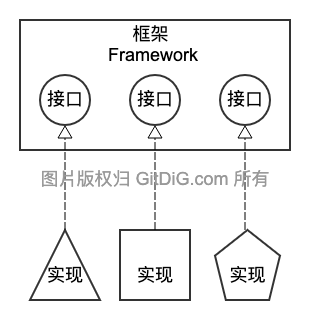

工作需要快速写了个`tcpserver`的框架，有效代码差不多 100 行左右，写篇文章分享下实现思路， 顺便解释一下如何实现类似网络服务的`Graceful Shutdown`功能。

首先，什么是框架？简单总结一下就是将变化交给用户，将不变交给自己，即**面向接口编程**。所以要实现一个简单的框架，第一步就是**明确接口**，对所有可能的变化进行接口级别的抽象。画一张简图说明下:



## tcpserver 框架的实现

就`tcpserver`框架程序而言，变化的部分非常有限：

- 监听类型
- 监听地址
- 客户端连接处理

那么，就可以将这三部分作为`tcpserver`的可选参数传递进去。所以，在尚未实现之前， `README` 文档中的 `Quick Start` 部分可以写起来了。

````go
import "github.com/x-mod/tcpserver"

srv := tcpserver.NewServer(
    tcpserver.Network("tcp"),
    tcpserver.Address(":8080"),
    tcpserver.Handler(MyHandler),
)

````

从这个简单的创建函数可知，`tcpserver.Handler`选项传入的是一个函数对象。既然是一个函数对象，就需要对其类型进行定义。通常而言，在函数类型定义时必须要注意的是参数问题，即参数不能过于复杂，同时必要的参数一个不能少。我这样定义接口函数：

````go
type ConnectionHandler func(context.Context, net.Conn) error
````

函数签名中最重要的参数是 `net.Conn` 参数，不论使用方如何实现，这个参数是必须的。所以作为独立的参数，直接定义。另外一个参数，上下文参数`context.Context`。上下文的特点与用途，无需多说了。通过它，可以传递各种变量信息与上层的中断信号。这样也就解决了参数定义不足的问题。

现在，再看看 `tcpserver.NewServer` 还缺少什么？显然就是启动函数与关闭函数了。参考 `http.Server` 的处理方式。在使用上，可以这样定义操作函数：

````go

func (srv *Server) Serve(ctx context.Context) error {
    //TODO
    return nil
}

func (srv *Server) Close() {
    //TODO
}

````

具体实现，可以直接参考我的项目代码[tcpserver](https://github.com/x-mod/tcpserver)。

接下来简单说下，类似服务端程序如何实现`Graceful Shutdown`功能。

## Graceful Shutdown 功能的实现

`Graceful Shutdown`的概念早就有了，只是在`Go`语言早期的版本中没有受到重视。好像是`context`包被移入系统包开始，`Graceful Shutdown`就开始被重视起来。为什么是从`context`包被移入系统包开始受到重视，还真是有一定联系。

什么是`Graceful Shutdown`，不妨看看官方在`net/http`包中的说明：

> Shutdown gracefully shuts down the server without interrupting any active connections. Shutdown works by first closing all open listeners, then closing all idle connections, and then waiting indefinitely for connections to return to idle and then shut down. If the provided context expires before the shutdown is complete, Shutdown returns the context's error, otherwise it returns any error returned from closing the Server's underlying Listener(s).

即`Graceful Shutdown`的具体操作步骤如下：

- 首先关闭所有监听接口
- 再关闭所有闲置连接
- 等待所有运行连接处理完成
- 上下文超时信号的处理

这样关闭服务程序的好处很明显，当然也有弊端：万一个别连接无法完成，程序可能就会一直等待。所以客户端处理逻辑上需要考虑这种异常情况，通过超时机制进行规避。

对于`tcpserver`而言，同样需要提供`Graceful Shutdown`功能。看看怎么来实现：

通过上节中 `Server.Close` 函数来触发 `Graceful Shutdown`。收到触发信号后，首先关闭监听，再等待所有客户端连接完成。具体程序实现如下：

````go
//Close tcpserver waiting all connections finished
func (srv *Server) Close() {
    //触发关闭信号
    close(srv.closed)
    //等待客户端连完成
	srv.wgroup.Wait()
}

//Serve tcpserver serving
func (srv *Server) Serve(ctx context.Context) error {
	ln, err := net.Listen(srv.network, srv.address)//开启监听
	...
	for {
		select {
		case <-ctx.Done():
			return ctx.Err()
		case <-srv.closed: //收到关闭信号
            log.Println("tcpserver is closing ...")
			return ln.Close()//关闭监听
        ...
    }
    ...
}
````

贴一小段代码方便大家阅读，具体代码请直接参考实现: [server.go](https://github.com/x-mod/tcpserver/blob/master/tcpserver.go)。为什么`context`很重要，因为除了自己定义chan作为信号触发机制以外，还可以通过`context`的超时或者取消机制进行信号的传递，具体实现不再赘述了。

## 后记

由于`serve.Serve`函数在`for`循环中一直阻塞在`Accept()`函数处，所以原代码中使用`close chan`的方式触发关闭过程失败。新版本直接通过关闭`Listener`的方式触发关闭。

````go
//Close tcpserver waiting all connections finished
func (srv *Server) Close() {
    //关闭监听，触发关闭信号
    srv.Listener.Close()
    //等待客户端连完成
	srv.wgroup.Wait()
}
````

以上。