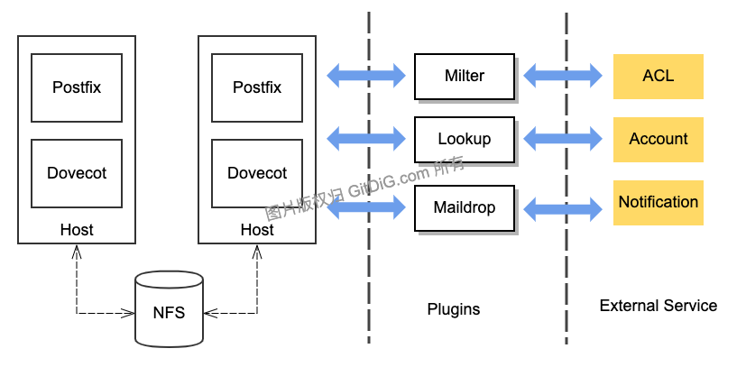

本系列文章包括以下三篇：

- [ ] 9102年，再玩一次邮件系统: 原理篇
- [x] [9102年，再玩一次邮件系统: 安装篇](/postfix-dovecot-in-action-02/)
- [x] [9102年，再玩一次邮件系统: 扩展篇](/postfix-dovecot-in-action-03/)

`postfix + dovecot`是一套非常成熟的邮件系统组合，该组合不仅仅是提供了非常稳定的`SMTP`,`IMAP`等收发邮件服务，还提供了非常灵活的集成与扩展接口。常规情况下基于邮件系统的集成与扩展主要涉及以下三方面：

- 账号体系集成
- 本地邮件投递
- 反垃圾策略扩展

## 1. 架构扩展图



## 2. 账号体系集成

账号集成需要集成以下四方面数据，分别是：

- **邮箱域名查询**
- **邮箱地址查询**
- **邮箱别名查询**
- **邮箱账号认证**

其中前三块查询是`Postfix`集成需要用到的，账号认证则是`Dovecot`要用到的。

### 2.1 postfix 集成

在`postfix`中主要通过以下三个配置集成外部账号数据。

````bash
# 设置域名
virtual_mailbox_domains = example.com ...more domains...
# 设置邮箱
virtual_mailbox_maps = hash:/etc/postfix/vmailbox
# 设置别名
virtual_alias_maps = hash:/etc/postfix/virtual
````

在[安装篇](/postfix-dovecot-in-action-02/)中提供了本地文件方式的数据集成。如果要集成外部服务，则需要通过`tcp`方式的集成。具体集成文档可参考：[TCP TABLES](http://www.postfix.org/tcp_table.5.html).

具体`tcp`方式的集成以[x-mod/tcpserver](https:://github.com/x-mod/tcpserver)项目作为基础进行集成。具体实现不赘述了。

### 2.2 dovecot 集成

在使用`postfix + dovecot`方式搭建的邮件系统，其认证方式是通过`dovecot`提供的`SASL`实现的。所以集成账号认证主要是在`dovecot`中实现的，`dovecot`提供了多种认证集成的方式，具体集成方式请参考:[AuthDatabase](https://wiki2.dovecot.org/AuthDatabase)。其中最灵活的集成方式，则是通过`Lua`脚本的方式。官方还提供了一个集成的`Lua`实现框架，只需要实现具体的集成代码就好。

认证功能的`lua`脚本框架，如下:

````lua
function auth_passdb_lookup(req)
  if req.user == "testuser1" then
    return dovecot.auth.PASSDB_RESULT_OK, "password=pass"
  end
  return dovecot.auth.PASSDB_RESULT_USER_UNKNOWN, "no such user"
end

function auth_userdb_lookup(req)
  if req.user == "testuser1" then
    return dovecot.auth.USERDB_RESULT_OK, "uid=vmail gid=vmail"
  end
  return dovecot.auth.USERDB_RESULT_USER_UNKNOWN, "no such user"
end

function script_init()
  return 0
end

function script_deinit()
end

function auth_userdb_iterate()
  return {"testuser1"}
end
````

 更多`lua`集成操作，请参考官方文档: [Lua](https://wiki2.dovecot.org/AuthDatabase/Lua).

## 3. 本地邮件投递

## 3.1 网络磁盘存储 NFS

对于邮件系统而言，针对本地邮件的投递首先要考虑的是**存储问题**。再细化一下，
就是**磁盘容量**与**访问方式**。**磁盘容量**可以通过**用户数量*邮箱最大配额**计算出来。**访问方式**则必须根据实际邮件系统的部署方式来决定。如果存在多台邮件传输代理`MTA`,则需要通过**网络磁盘**的方式提供统一的邮件存取接口。

传统的企业邮箱存储方案都采用`NFS`方案。如果邮件系统是针对互联网用户而言，`NFS`就不合适了，需要采用更加现代的网络存储方案。关于如何搭建`NFS`系统服务，这里有一篇文章可以参考:[how-to-mount-nfs-shares-on-debian-9](https://www.linode.com/docs/networking/nfs/how-to-mount-nfs-shares-on-debian-9/).

## 3.2 本地邮件投递/通知

除了在邮件存储方面的扩展外，另外一个有实际意义的扩展，就是**新邮件通知**功能。在[安装篇](/postfix-dovecot-in-action-02/)中，提供以下本地投递的配置：

````bash
# 本地投递 - 采用 dovecot 提供的本地投递服务
# virtual_transport = lmtp:unix:private/dovecot-lmtp

# 本地投递 - 采用自定义的投递程序
virtual_transport = maildrop

# 默认本地投递 - 采用 postfix 提供的本地投递服务, 需以下配置
# virtual_mailbox_base = /var/mail/vhosts
# virtual_minimum_uid = 100
# virtual_uid_maps = static:5000
# virtual_gid_maps = static:5000
````

即，可以选择 `dovecot-lmtp` 作为投递程序，也可以采用自定义的投递程序`maildrop`作为投递程序，还可以使用`postfix`系统默认的方式投递。这里采用自定义投递程序`maildrop`的方式进行本地投递，灵活度最高。

具体投递程序的开发，请参考文档: [MAILDROP_README](http://www.postfix.org/MAILDROP_README.html).

## 4. 邮件反垃圾扩展

`postfix` 本身就提供非常丰富的反垃圾配置，如果要集成外部系统的`ACL`功能，则需要在`postfix`提供的邮件过滤插件中实现。官方参考文档：[MILTER_README](http://www.postfix.org/MILTER_README.html).

如何自己实现一个简单的`Milter`邮件过滤程序，`github`上有两个具体的开源项目可供使用。不过，因其在使用的便利性上有点欠缺，专门做了一点使用上的改造。具体改造后的项目可以参考:[x-mod/milter](https://github.com/x-mod/milter).

## 小结

鉴于邮件系统如今比较小众，文章也就写得简明扼要点。如有疑问请留言，会尽快解答。


