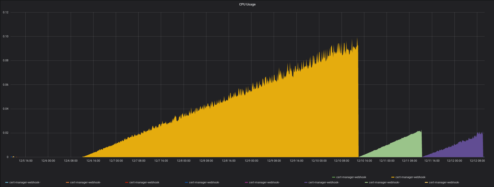
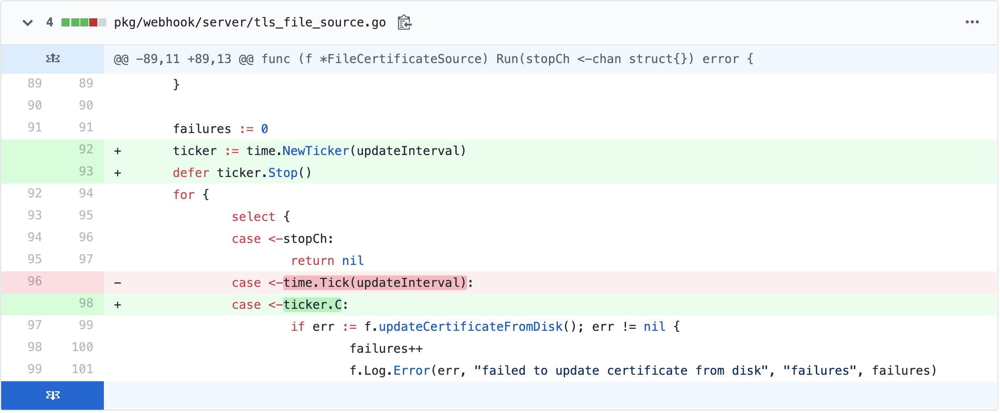

前段时间给后端几个服务配证书，试着用了一下 `Cert-Manager` 项目。 Github 几千 Star 的项目使用起来的确很方便，秒配域名免费证书。但是，运行了三天，机器CPU报警：



赶紧去项目 issues 里搜，果真遇到类似不止我一个, 问题竟然没修复，直接流汗了。不过还好，第二天这个问题就修复了。这里贴一下修复者的代码：



不妨看看`Cert-Manager`项目CPU泄露的原因，就是因为在循环中，不停的创建新的计时器，而每个计时器都会开启内部协程。再看看计时器函数的官方注释：

````go
// Tick is a convenience wrapper for NewTicker providing access to the ticking
// channel only. While Tick is useful for clients that have no need to shut down
// the Ticker, be aware that without a way to shut it down the underlying
// Ticker cannot be recovered by the garbage collector; it "leaks".
// Unlike NewTicker, Tick will return nil if d <= 0.
func Tick(d Duration) <-chan Time {
	if d <= 0 {
		return nil
	}
	return NewTicker(d).C
}
````

官方直接说了，需要谨慎使用，会有泄漏风险。不过很少有人会真正关注这一段注释的。CPU 资源为什么会发生泄露，直接原因通常都是：**在一个“死循环”里，不停开启永不关闭的协程或线程。**

用代码解释就是这样：

````go
for {
  go never_die()
}
````

当然没人会真正写出这样的代码，但是如果程序CPU泄露了，其本质就是这样。同样计时器的另一个函数`time.After`也存在类似误用的风险。

如何真正的规避资源泄露的问题呢？

除了对第三方库的实现有必要的了解以外，解决的办法还是：技术问题技术解决。那就是可以通过程序性能调试工具 `go tool pprof` 辅助调试，网上参考资料非常多，不赘述了。

判断资源泄露通常可以通过一定时间运行或大量模拟请求监测程序资源的使用情况，是否发生图示情况：**线性增长**。如果类似情形一直得不到缓解的话就可以判定程序发生了资源泄露。

为了尽量保证文字的正确性，专门去官方Go语言项目上查了下，计时器问题貌似一直是一个问题，看评论说是会在`1.14`中更新，拭目以待吧。

- [issues/27707](https://github.com/golang/go/issues/27707)

鉴于文章篇幅过短，加个彩蛋：

> 在 Mac 系统上如何从容器访问本机网络？

如果你第一反应是，修改 Docker 容器启动时的网络模式，可能要失望了。因为在 Mac 系统上 Docker 的运行方式是在虚拟机上运行的。所以即使采用 `--net host` 模式，你也无法访问 Mac 系统本身的网络，访问只是 Docker 服务运行的虚拟机网络。

谜底就是：`host.docker.internal`， 在 Mac OS/Windows 系统上可以通过该 `hostname` 的方式直接访问本机网络。
