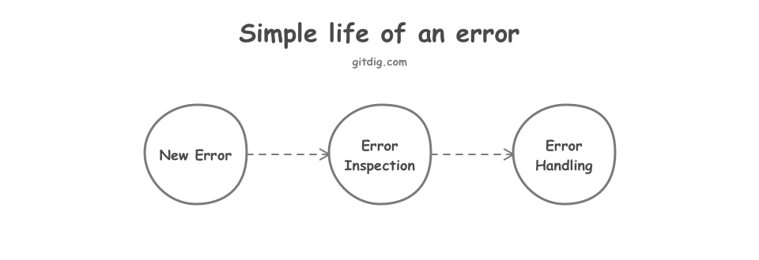
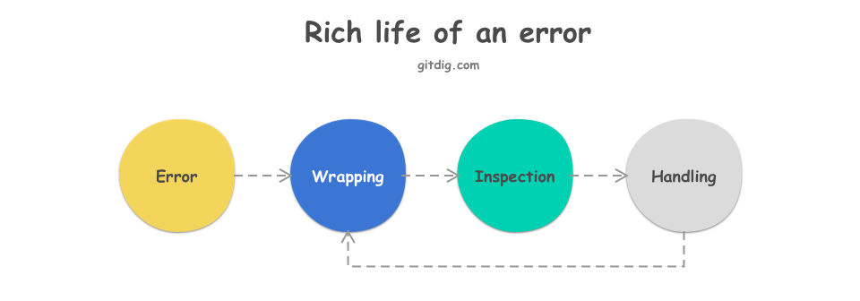

Go 1.13 发布后，一直没有就错误(error)扩展包进行升级。借着升级，就 Go 错误(error)处理做一下梳理。主要内容包括：

- **错误处理的基本过程**，回顾错误相关的基础知识
- **错误处理的高级过程**，实际项目错误的处理过程
- **Go 1.13 升级与应用**，将升级应用到错误扩展包
- **Go 2.0 提案**，关于错误的部分

# 1. 基本过程

在 Go 语言中，错误(error)从诞生到死亡（即被处理）的基本过程是这样的：

````go

    if err := foo(); err != nil {
        //handle the err
    }

````
这段代码揭示了错误的最简单的生命周期，图示如下：



## 1.1 错误诞生

什么是错误？

错误可以是任意类型的值(value), 只要该类型实现了 `error` 接口即可。`error` 接口定义如下：

````go
type error interface{
    Error() string
}
````

通过系统库可以快速创建错误：`errors.New`或`fmt.Errorf`。这是方法一。

方法二，定义自己的错误类型，实现错误接口。如下：

````go
type ErrNo int32

func (e ErrNo) Error() string {
	return fmt.Sprintf("ErrNo(%d)", e)
}
````
这样就可以定义一个整型错误，直接通过类型切换就可以创建错误：`ErrNo(400)`。

## 1.2 错误检查（Inspection）

在错误的整个生命周期中，最关键的环节就是**错误检查**。在官方博客：[errors are values](https://blog.golang.org/errors-are-values)，中标注了这样一条开发原则：

> **Whatever you do, always check your errors!**

所以在代码中永远不要出现 `_` 符号去忽略错误返回值。对错误进行检查十分重要，官方相关文档给出了四种错误检查的方式，分别是：

1. **哨兵错误(sentinel errors)检查**，如 io.EOF 等等。

````go
//package io
var ErrUnexpectedEOF = errors.New("unexpected EOF")

//package main
if err == io.ErrUnexpectedEOF { ... }
````
哨兵错误检查，存在的问题是：哨兵错误有可能被重新置值。所以在实践中，最好的方式是：定义常量错误。参考 Dave 的博客：[Constant errors](https://dave.cheney.net/2016/04/07/constant-errors)。

2. **错误类型断言与类型切换检查**

通过具体类型断言与类型切换进行错误值的检查，如下：

````go
if pe, ok := err.(*os.PathError); ok { ... pe.Path ... }
````

3. **特殊类型错误检查**，通过特定的检查函数进行检查，如 os.IsNotExist 等等

````go
if os.IsNotExist(err) { ... }
````
在检查函数`os.IsNotExist`中，仍然会使用**2. 错误类型断言与类型切换检查**的方式进行错误类型切换，再判断具体错误值。

4. **错误文本检查**，通过 err.Error() 返回的字符串文本进行匹配检查，也是最不推荐的错误检查方式。

以上四种错误检查的方式，只能算是将错误检查做了几个基础分类。关于如何更加有效的进行错误检查，Dave 的另一篇博客：[Inspecting errors](https://dave.cheney.net/2014/12/24/inspecting-errors), 提出了一条更加实用的原则：

> **Don’t assert errors for type, assert for behaviour**.

作者写了一个简单的对错误行为进行检查的例子，如下:

````go
func isTimeout(err error) bool {
        type timeout interface {
                Timeout() bool
        }
        te, ok := err.(timeout)
        return ok && te.Timeout()
}
````
可以将这种按行为进行错误检查的方式归属到**特殊类型错误检查**这个类别。

## 1.3 错误处理（Handling）

错误处理可按照实际业务需求进行操作，如忽略、处理、或是抛出等。

# 2. 高级过程

错误的基本过程非常简单，但并不实用。在实际的项目中，错误的生命周期是这样的：



错误并不会在第一时间被处理掉，更多的是被包装，再次向上抛出；再检查，再处理。对比**简单过程**与**高级过程**，不难看出，在高级过程中增加了**错误包装**环节。

## 2.1 为什么需要包装错误？

举个最简单的例子，如下代码：

````go
func A() error {
	if err := B(); err != nil {
		return err
	}
	if err := C(); err != nil {
		return err
	}
	return a()
}
````
现在在主函数中调用 `A` 函数, 并对函数返回的错误值进行检查。如何判断是`B`、`C`,还是`a`何处发生错误呢？

显然，如果不对`B`、`C`,还是`a`发生的错误进行**包装**处理，那么对`A`返回的错误就很难进行精确判断。

## 2.2 如何包装错误

包装错误的目的，是为了更精确的检查错误。如何包装错误也就取决于如何检查和处理错误。实际项目中包装方式会因人或项目而异，但有一条基本原则：**无论何种方式包装错误，都必须能够解包原始错误**。现在举几个常见的错误包装的例子：

- **调用栈包装**

即在错误发生的第一现场，对错误的调用栈进行包装，这样就可以通过打印错误日志的方式定位到错误发生的地点。[github.com/pkg/errors](https://github.com/pkg/errors)给出了很好的实现。

包装函数是这样的：

````go
import "github.com/pkg/errors"

//! 调用栈包装
err = errors.WithStack(err)
````

因为调用栈包装的错误主要用于错误的日志打印上，所以该包提供检查方式是，通过增加`%+v`的格式符输出错误的调用栈信息。

````go
fmt.Printf("%+v", err)
````

解包函数:

````go
import "github.com/pkg/errors"

err = errors.Unwrap(err)
````

- **备注包装**

实现一个错误的备注包装非常简单，定义一个错误的备注包装类型,重新实现 `error` 接口即可：

````go
package errors

type annotator struct {
	err        error
	annotation string
}

//Annotate an error with annotation
func Annotate(err error, annotation string) error {
	if err != nil {
		return &annotator{err: err, annotation: annotation}
	}
	return nil
}

//Annotatef an error with annotation
func Annotatef(err error, format string, args ...interface{}) error {
	if err != nil {
		return &annotator{err: err, annotation: fmt.Sprintf(format, args...)}
	}
	return nil
}

//Error annotator implemention
func (err *annotator) Error() string {
	return fmt.Sprintf("%s %s", err.annotation, err.err.Error())
}

//Unwrap annotator original error
func (e *annotator) Unwrap() error {
	return e.err
}
````

- **错误码包装**

除了备注包装以外，另外一种常用的包装就是**错误码包装**，甚至可以直接将错误码类型做为错误进行实现，如前面章节中的`ErrNo`类型错误的定义。

实际项目中错误码包装稍微复杂一点，因为涉及一些RPC调用类错误码的转译。不妨以GRPC错误码为例，
实现一个简单的错误码包装类型：

````go
package errors

//Code 类型接口定义
type Code interface {
	Value() int32
	String() string
}

//codeErr 错误代码包装类型
type codeErr struct{
	err error
	code Code
}

//Code 包装函数
func WithCode(err error, code Code) error {
	if err != nil {
		return &codeErr{err: err, code: code}
	}
	return nil
}

//Error 接口实现
func (err *codeErr) Error() string {
	return err.err.Error()
}

//Unwrap 解包原始错误
func (err *codeErr) Unwrap() error {
	return err.err
}
````

熟悉 `grpc/codes` 代码的同学知道，grpc框架中定义的错误码是通过常量的型式定义，再通过`stringer`工具生成对应的字符串描述函数。同样的方式可以适用于个人或企业项目中的错误码定义。

````go
package codes

type Code int32

func (code Code) Value() int32 {
	return int32(code)
}

//go:generate stringer -type Code
const (
	// OK is returned on success.
	OK Code = 0
	// custome code
	Unknown Code = 101
	// ... more code
)
````
这样通过`go generate` 就可以生成对应的项目错误码了。同时可以将错误码做为单独的`repo`进行管理，与错误码包装分开,实现解耦。

以上**错误码包装类型**的实现还差一个关键接口，即**取值接口**。为了实现错误的取值，不妨针对错误码包装类型实现一个匿名的`Value`接口，参考 **Don’t assert errors for type, assert for behaviour** 原则。

````go

//实现取值匿名接口
func (err *codeErr) Value() int32 {
	if err.code != nil {
		return err.code.Value()
	}
	return -1
}

//错误取值辅助函数
func ValueFrom(err error) int32 {
	if err != nil {
		for err != nil {
			//from grpc status
			if st, ok := status.FromError(err); ok {
				return int32(st.Code())
			}
			//实现取值匿名接口
			if cd, ok := err.(interface {
				Value() int32
			}); ok {
				return cd.Value()
			}
			err = errors.Unwrap(err)
		}
		return -1
	}
	return 0
}
````
错误取值辅助函数中，有一段 `grpc/status`的代码，主要用于从 `grpc` 调用返回错误中取值。当然要在 `grpc`客户端调用中取得错误码值，前提`grpc`服务端函数实现中包装了错误码信息。

GRPC如何C/S之间如何传递错误码，请参考：

- 服务端如何实现错误码值的转译，请参考`GRPCStatus`函数接口。
- 客户端如何读取错误码数据，请参考[status.FromError](https://github.com/grpc/grpc-go/blob/master/status/status.go#L141)的实现说明。

所以，在错误码包装类型上再增加`GRPCStatus`接口函数的实现供GRPC服务端框架代码调用：

````go
//GRPCStatus make codeErr support grpc status
func (ce *codeErr) GRPCStatus() *status.Status {
	return status.New(codes.Code(ce.code.Value()), ce.err.Error())
}
````

以上就完成了从 GRPC 客户端获取服务端错误码值的功能。

# 3. Go 1.13 升级与应用

Go 1.13 版本升级针对错误的部分其实就是增加了官方的错误包装与错误检查函数接口。

## 3.1 错误包装

官方的错误包装，其实就是提供了**备注包装**官方接口，即通过`fmt.Errorf`函数，增加`%w`参数的方式对错误进行包装。

````go
	//备注包装
	err = fmt.Errorf("B: %w", err)
````

## 3.2 错误处理

增加了包装接口，就必须提供接包函数：`errors.Unwrap`, 返回错误的根因。同时，经过包装的错误类型必须实现`Unwrap`接口，解包函数才对其有效。

增加了两个错误检查功能函数`Is`与`As`，分别对应于**哨兵错误**与**类型切换**方式的错误检查。如：

````go
//! 哨兵错误检查
if err == io.ErrUnexpectedEOF { ... }

//same as
if errors.Is(err, io.ErrUnexpectedEOF) { ... }

//! 错误类型切换
if pe, ok := err.(*os.PathError); ok { ... pe.Path ... }

//same as
var pe os.PathError
if errors.As(err, &pe) {... pe.Path ...}
````
之所以需要提供这样两个功能函数，是因为需要对于可能进行包装的错误进行逐次解包操作。

## 3.3 升级错误扩展包

虽然在实际项目中使用的错误包已经具备了**备注包装**的功能，但是还是有必要将其升级到 `1.13` 版本。很简单直接，增加一个`go1.13`版本交叉实现即可。

````go
// +build go1.13

package errors

import "fmt"

//Annotate an error with annotation
func Annotate(err error, annotation string) error {
	if err != nil {
		return fmt.Errorf("%s %w", annotation, err)
	}
	return nil
}

//Annotatef an error with annotation
func Annotatef(err error, format string, args ...interface{}) error {
	return Annotate(err, fmt.Sprintf(format, args...))
}
````
将原有的实现增加`// +build !go1.13`条件备注即可。

# 4. Go 2.0 提案

[Go 2.0 提案](https://go.googlesource.com/proposal/+/master/design/go2draft.md). 提案中，主要提出了三个待解决的问题：

- 错误处理问题
- 错误值的问题，即错误检查问题
- 泛型问题

抛开泛型问题不谈，可见错误(error)问题是 Go 2.0 的重中之重。

## 4.1 错误处理(handling)问题

首先，我们看一下现有 Go 版本是如何处理错误的，贴一段 Go 2.0 提案中的样例代码：

````go
func CopyFile(src, dst string) error {
	r, err := os.Open(src)
	if err != nil { // 错误检查
		return fmt.Errorf("copy %s %s: %v", src, dst, err)// 错误处理
	}
	defer r.Close()

	w, err := os.Create(dst)
	if err != nil {// 错误检查
		return fmt.Errorf("copy %s %s: %v", src, dst, err)// 错误处理
	}

	if _, err := io.Copy(w, r); err != nil {// 错误检查
        // 错误处理
        w.Close()
		os.Remove(dst)
		return fmt.Errorf("copy %s %s: %v", src, dst, err)
	}

    if err := w.Close(); err != nil {// 错误检查
        // 错误处理
		os.Remove(dst)
		return fmt.Errorf("copy %s %s: %v", src, dst, err)
	}
}
````

很明显，在处理错误以及错误检查上，出现了大量的重复代码，处理错误的代码行数甚至超过逻辑代码。面对类似错误处理的代码冗余问题，官方这篇博客([errors are values](https://blog.golang.org/errors-are-values))给出了解决方案, 同时文章也指出其方案的问题。更好的方案，当然是提案中的设计方案，从语言层面，增加错误语法(error syntax)解决问题。如下：

````go
func CopyFile(src, dst string) error {
	handle err {
		return fmt.Errorf("copy %s %s: %v", src, dst, err)
	}

	r := check os.Open(src)
	defer r.Close()

	w := check os.Create(dst)
	handle err {
		w.Close()
		os.Remove(dst) // (only if a check fails)
	}

	check io.Copy(w, r)
	check w.Close()
	return nil
}
````
这个设计方案就在语言层面增加新的关键字`handle`与`check` 来简化异常的处理逻辑。

## 4.2 错误检查(inspection)问题

Go 2.0 提案中错误值的问题，即错误检查问题，其实在 Go 1.13 中初步实现了。

本文相关开源项目请参考：[x-mod/errors](https://github.com/x-mod/errors).

# 相关参考

- [Constant errors](https://dave.cheney.net/2016/04/07/constant-errors)
- [Don’t just check errors, handle them gracefully](https://dave.cheney.net/2016/04/27/dont-just-check-errors-handle-them-gracefully)
- [Inspecting errors](https://dave.cheney.net/2014/12/24/inspecting-errors)
- [errors are values](https://blog.golang.org/errors-are-values)
- [Go 2.0 Proposal: error handling overview](https://go.googlesource.com/proposal/+/master/design/go2draft-error-handling-overview.md)


