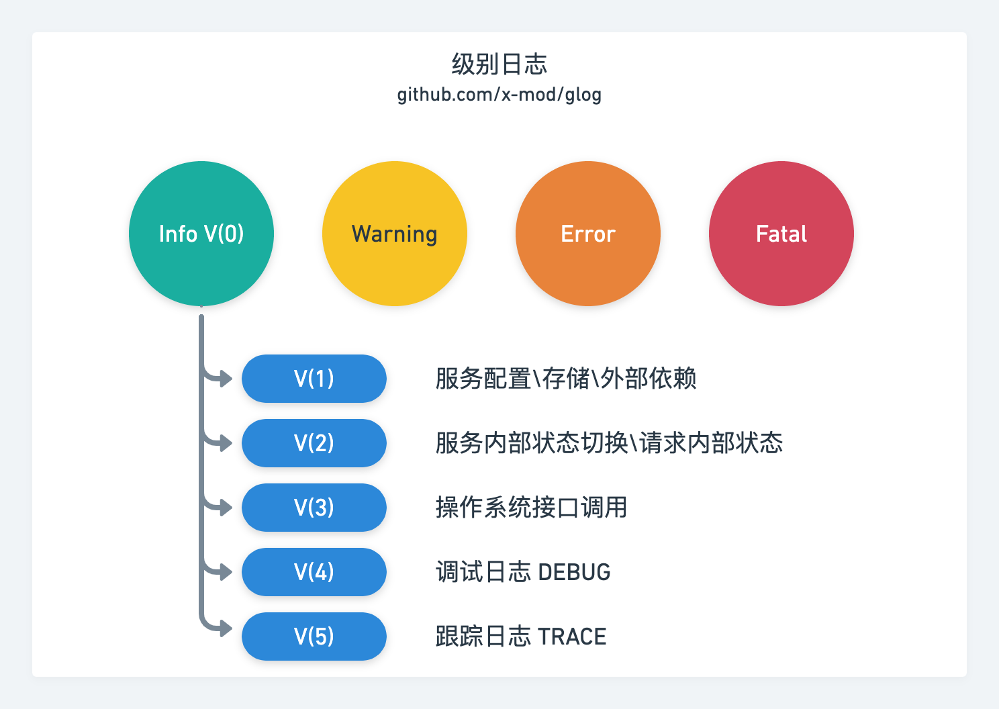
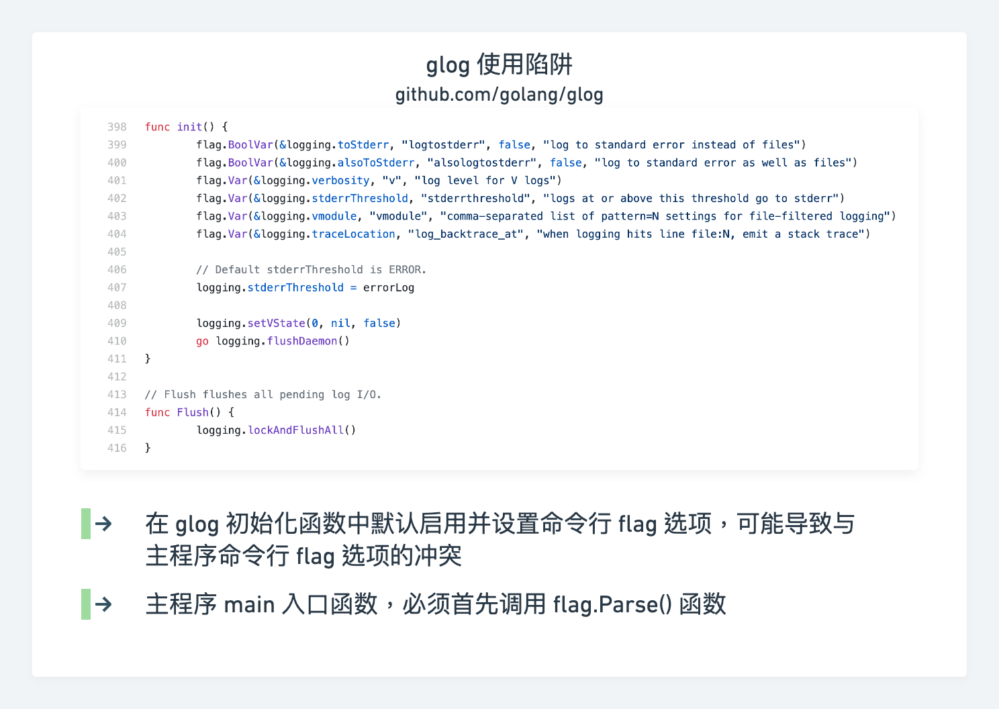
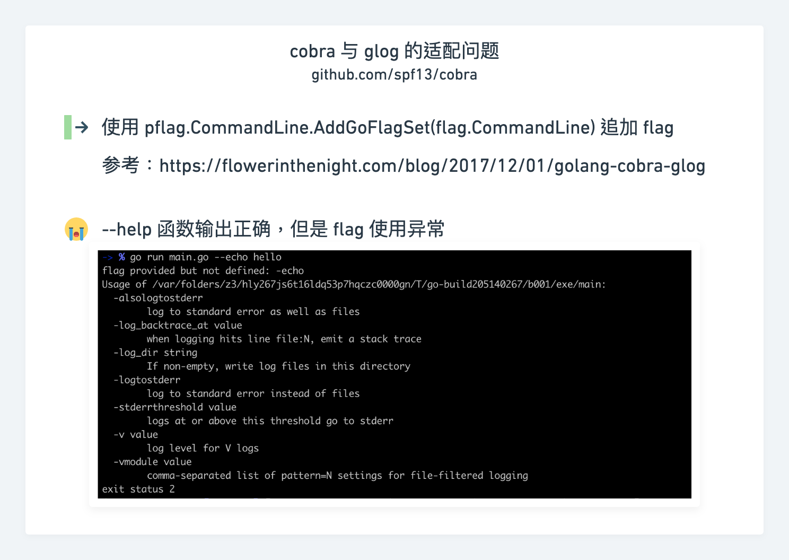
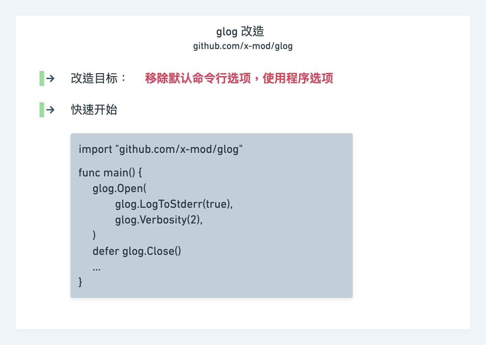

通常而言，日志打印会按错误级别进行打印，如:【**Fatal**,**Error**,**Warning**,**Info**】等级别。
但在实际项目开发过程中，还会涉及到一些内部状态切换、基础库以及框架的使用。这些信息显然不能按照错误级别进行打印。
所以对 **Info** 级别日志进行二次分级是必要的。

项目 [github.com/golang/glog](https://github.com/golang/glog) 就是这样一个提供二次分级的日志项目。然而这个年迈的项目，当初在设计接口的时候过于为使用者操心了，反而降低了其灵活性。这也是为什么会出现：

- [github.com/kubernetes/klog](https://github.com/kubernetes/klog)
- [github.com/grpc/grpc-go/grpclog](https://github.com/grpc/grpc-go/grpclog)

项目的原因。

### 级别规范 

打印级别日志，首先需要规定好相应的级别规范。以下是 [github.com/x-mod](https://github.com/x-mod) 使用的级别规范，供参考。

### glog 陷阱

### cobra 适配问题
相信很多命令行程序，大家都会使用 `cobra` 库。但是在 `cobra` 中如何适配 `glog` 有点问题。

### glog 改造

## 参考资源:

- [Using glog together with cobra in golang](https://flowerinthenight.com/blog/2017/12/01/golang-cobra-glog)
